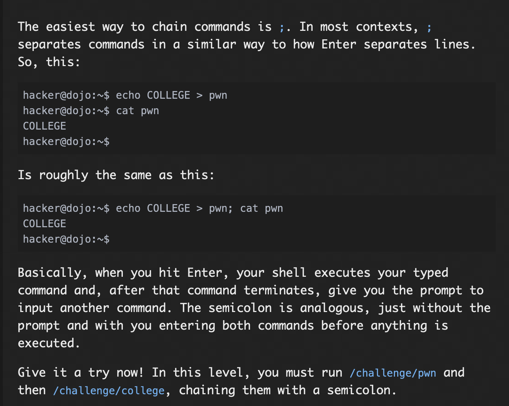
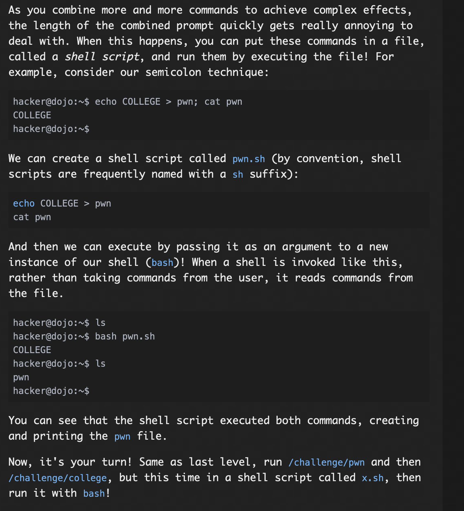
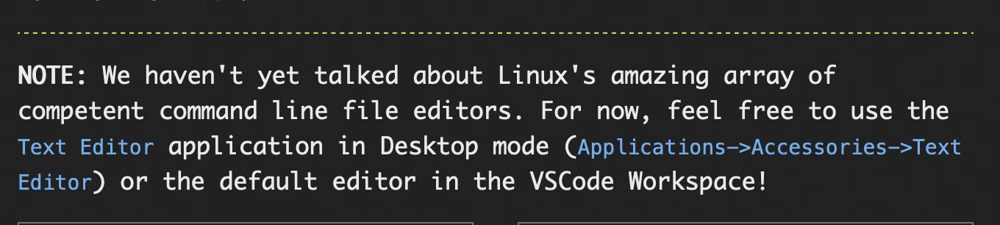
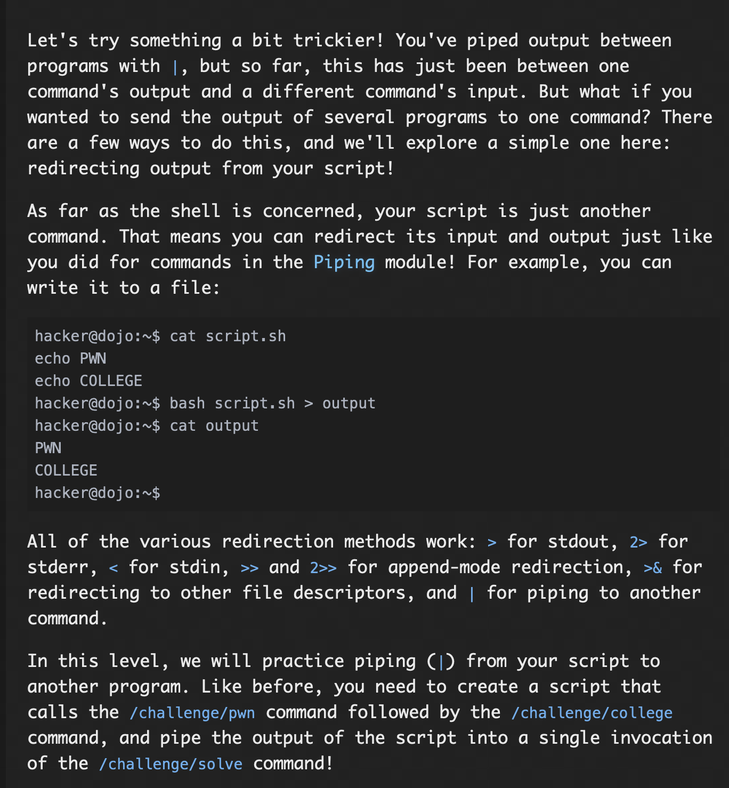
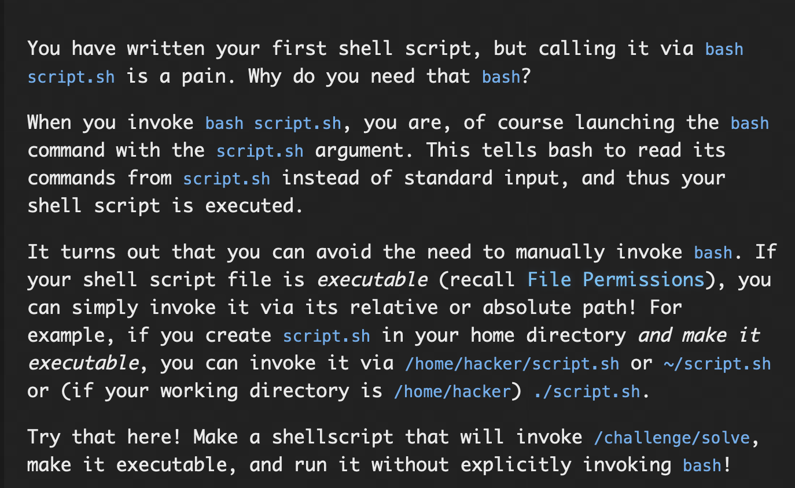

# **Chaining Commands**

## Chaining with Semicolons

### Problem:


### Solution:

When we use ';' between two commands, it executes them one after the other without the promt to input the second command.

This challenge just asks to chain ```/challenge/pwn``` and ```/challenge/college``` using ;(```/challenge/pwn;/challenge/college```), this gives the flag.

#### flag: ```pwn.college{IlwcgzJqKQ2zJGEtPBGev_RrqQ5.dVTN4QDL0kTO3czW}```

## Your First Shell Script

### Problem:



### Solution:
For this challenge, first i created a file called "x.sh" using touch command(```touch x.sh```), then opened the file using vim editor (```vim x.sh```), then in the insert mode, added the commands ```/challenge/pwn``` and in the next line ```/challenge/college```, then esc, :w, :q, after this, gave the command ```bash x.sh```, this gave me the flag.

#### flag: ```pwn.college{kAUAHmx8l497Z4mOnoYsez2qkm7.dFzN4QDL0kTO3czW}```

## Redirecting Script Outputs

### Problem:


### Solution:

or this challenge, first i created a file called "x.sh" using touch command(```touch x.sh```), then opened the file using vim editor (```vim x.sh```), then in the insert mode, added the commands ```/challenge/pwn``` and in the next line ```/challenge/college```, then esc, :w, :q, after which using live piping i piped the output of x.sh to ```/challenge/solve```, using the command ```bash x.sh | /challenge/solve```, this gave me the flag.

#### flag: ```pwn.college{89D22awnYGGON3WrwTlTAXTDbE4.dhTM5QDL0kTO3czW}```

## Executable Shell Scripts

### Problem:



### Solution:

For this challenge, i created a file using touch then using vim, entered ```/challenge/solve``` in the script saved it and exited vim, confirmed the write using ```cat x.sh``` command, once done, using the command ```chmod 744 x.sh```, gave the script executable permissions, then by specifying relative path ```./x.sh```, executed the script, this gave the flag.

#### flag: ```pwn.college{k5ub0efsUVLVSrVXTqDYp7H8m5z.dRzNyUDL0kTO3czW}```