# **Comprehending Commands**

## cat: not the pet, but the command

### Problem:
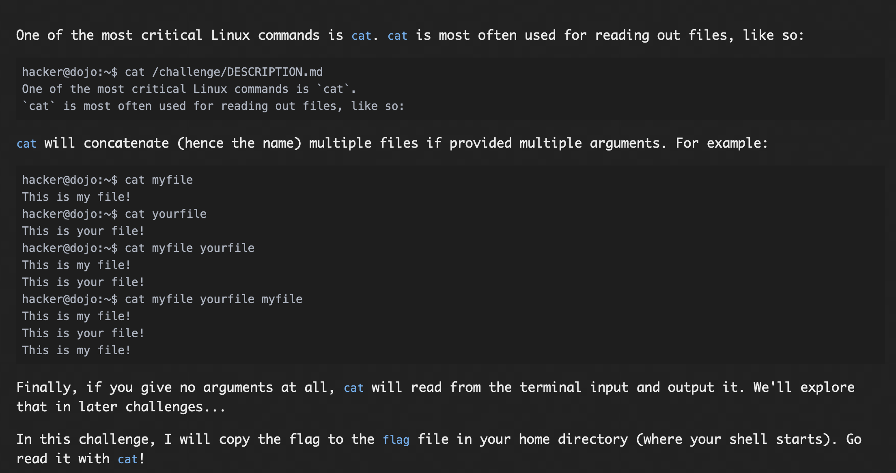

### Solution:
The cat command is genrally used to read out a file, but actually when mutiple arguments are passed the arguments are con```cat```enated. 
First we change directory to flag as it is a directory using ```cd ~/flag``` and inside that directory the flag file is read using cat command ```cat flag```

#### flag: ```pwn.college{0lYI130WQheLMuE3wxkiC-kunOX.dFzN1QDL0kTO3czW}```


## catting absolute paths

## Problem:
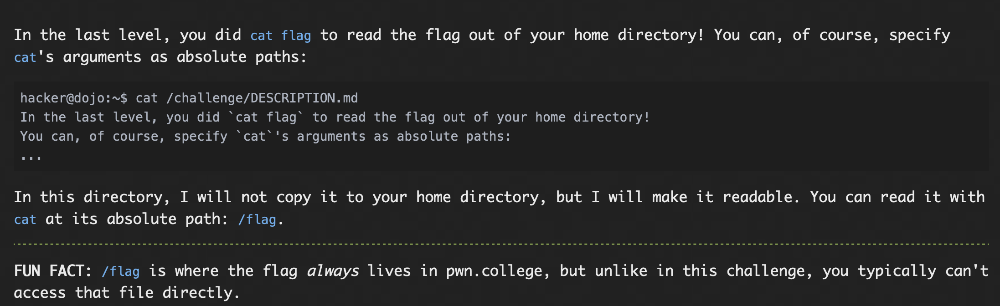

### Solution:
cat command is used along with passing the absolute path

```cat /flag```

#### flag: ```pwn.college{APSWECdzCPEGteFsj0JJMpUKcjd.dlTM5QDL0kTO3czW}```

## More Catting Practice

### Problem:
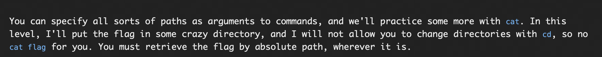

### Solution:
similar to the last one 

#### flag: ```pwn.college{QH12g90sQrvuS9V7lchxjFhBLnf.dBjM5QDL0kTO3czW}```

## Greeping for a needle in a haystack

### Problem: 
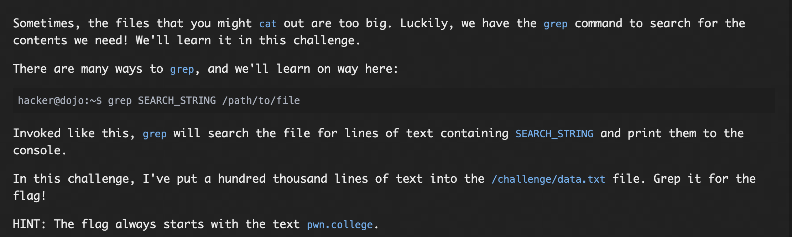

### Solution:
Since the contents of file are very long we use the grep command to search for the pwn.college string in ```/challenge/data.txt``` 

#### flag: ```pwn.college{INALgrDbM7GvovtM6DQNtACz1kT.ddTM4QDL0kTO3czW}```

## Listing files

### Problem:
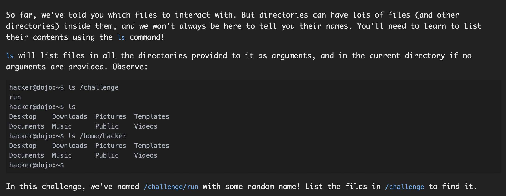

### Solution:
Since /challenge/run has been renamed to something else, i list down the contents of cwd and after that search for the renamed run command, after that it is executed using ```/challenge/26436-renamed-run-15674```

#### flag: ```pwn.college{47Oy4QHDLO6JRV6JRuzBYbzCeOb.dhjM4QDL0kTO3czW}```

## touching files

### Problem: 
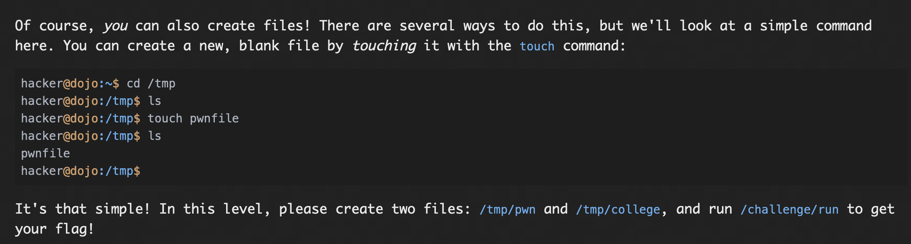

### Solution:
First, i went to tmp directory using ```cd /tmp``` and after that, 2 files are created using ```touch pwn``` and ```touch college``` and after this, ```/challege/run``` is given in command-line, which gives the flag.

#### flag: ```pwn.college{U0McQzgfb2m3-gM1COCWFR9d6ek.dBzM4QDL0kTO3czW}```

## Removing files

## Problem:
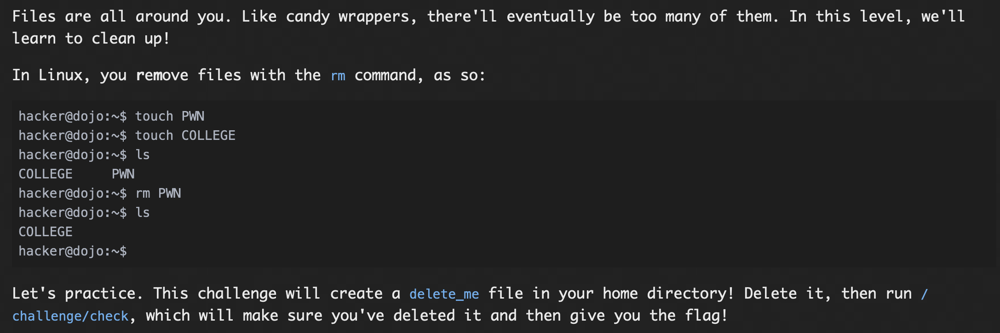

### Solution:
First the file delete_me is deleted using the command ```rm delete_me```, after this ```/challenge/run``` is given in command-line.

#### flag: ```pwn.college{kMlq7rMJNGdKpVnX4JEMf6HYPr9.dZTOwUDL0kTO3czW}```

## Hidden Files

### Problem:
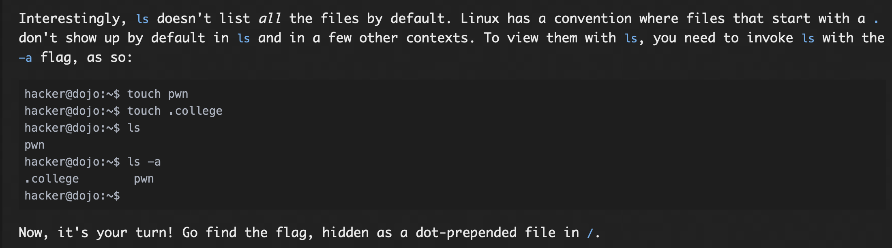

### Solution:
ls doesn't shows all the files, so -a is used with ls command, and given to command line ```ls -a```, after that we get the hidden . file called ```.flag-531760485479``` which is then read using the command ```cat .flag-531760485479```

#### flag: ```pwn.college{syfbqcqpP_GnW7KUr0nwHZynkbg.dBTN4QDL0kTO3czW}```

## An epic filesystem quest

### Problem:
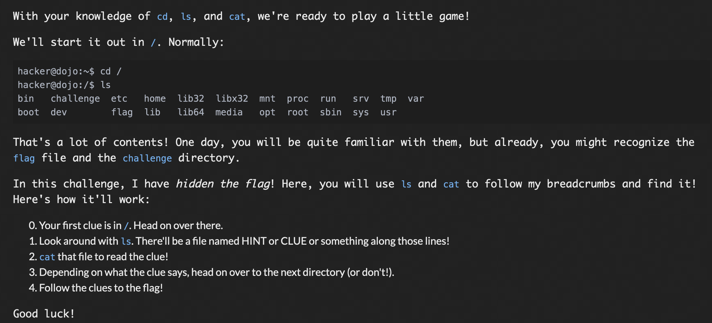

### Solution:
First we got the the root directory using ```cd /```

After this, the contents are listed using ```ls -a```

After which, using hit and trial method, DOSSIER file is read using cat command ```cat DOSSIER```

This gives us a hint which makes us redirect to a different directory using ```cd /opt/linux/linux-5.4/drivers/gpu/drm/msm/disp```

Then again the contents are read using ```ls -a```

Now using hit and trial the file .REVELATION is read using ```cat .REVELATION``` command

Now we are supposed to read some file inside the folder that is given as the next hint without using cd, so the contents are directly listed using ```ls opt/linux/linux-5.4/drivers/crypto/cavium```

This gives us a file called INSIGHT-TRAPPED, which is read again, using ```cat opt/linux/linux-5.4/drivers/crypto/cavium/INSIGHT-TRAPPED``` as using cd is not allowed.

This gives us another path to the next clue, using cd we go to that location using ```cd /usr/local/BurpSuiteCommunity/jre/lib```

Now the items here are listed using ```ls```, which gives multiple items, one of them called POINTER

This POINTER file is read using ```cat /usr/share/javascript/mathjax/unpacked/jax/output/HTML-CSS/fonts/Asana-Math/NonUnicode```

This gives us another file called TIP after reading using ```ls```, which is again catted using ```cat TIP```

After this we are given next path , we go to the next directory using ```cd /opt/aflplusplus/nyx_mode/QEMU-Nyx/target/xtensa/core-de212```

The contents are read, using ```ls```, which gives a file called HINT.

This HINT file is read using ```cat HINT```

We get the path to next directory, we can't use cd so we have to read its contents using ```ls /opt/linux/linux-5.4/drivers/gpu/drm/msm```

This results in many files one of them being BRIEF-TRAPPED, which is then read using ```cat /opt/linux/linux-5.4/drivers/gpu/drm/msm/BRIEF-TRAPPED```

We get the hint to the next directory, we go there using ```cd /opt/angr-management/_internal/PySide6/Qt/qml/QtDataVisualization/designer/images```

Then the files are listed using ```ls```

We get multiple files, one of them being TRACE, this file is read using ```cat TRACE```

Then we get the path to next one, we use ```cd /opt/linux/linux-5.4/fs/efs```.

As the contents are hidden, we use ```ls -a```, we get a .INFO file.

This .INFO files are read using ```cat .INFO```

This finally lends us the flag.

#### flag: ```pwn.college{wuhXB4lJvqedwDf1-cMZgAz-F2-.dljM4QDL0kTO3czW}```

## Making Directories

### Problem: 
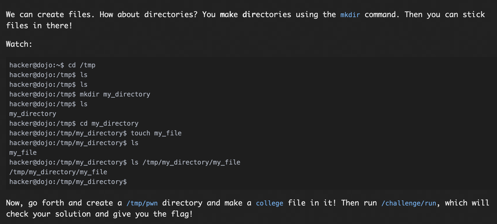

### Solution:

First, we go to tmp directory using ```cd /tmp```, after this a directory is created using ```mkdir pwn```.

Then we go to the pwn directory using ```cd pwn```, after this, a file called college is created using ```touch college```.

Now we give the command ```/challenge/run``` in the command line, which gives the flag.

#### flag: ```pwn.college{IbEobmmtaSJyOPSHpXUoIWkv13R.dFzM4QDL0kTO3czW}```

## Finding flags

### Problem:
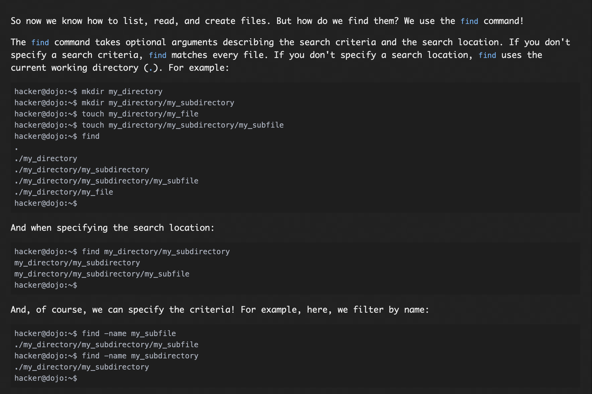
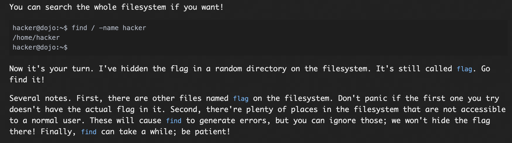

### Solution:
Using the find command in root directory with -name and flag as the name string

```find / -name flag```, this gives multiple search result, a lot of them being permission denied, so this narrows the search, after trial and error we read the file using ```cat /opt/linux/linux-5.4/drivers/pinctrl/zte/flag```, this gives us the flag

#### flag: ```pwn.college{4aHv7oQ7oCzRsYrjREbYA-FYa-L.dJzM4QDL0kTO3czW}```

## Linking files

### Problem:
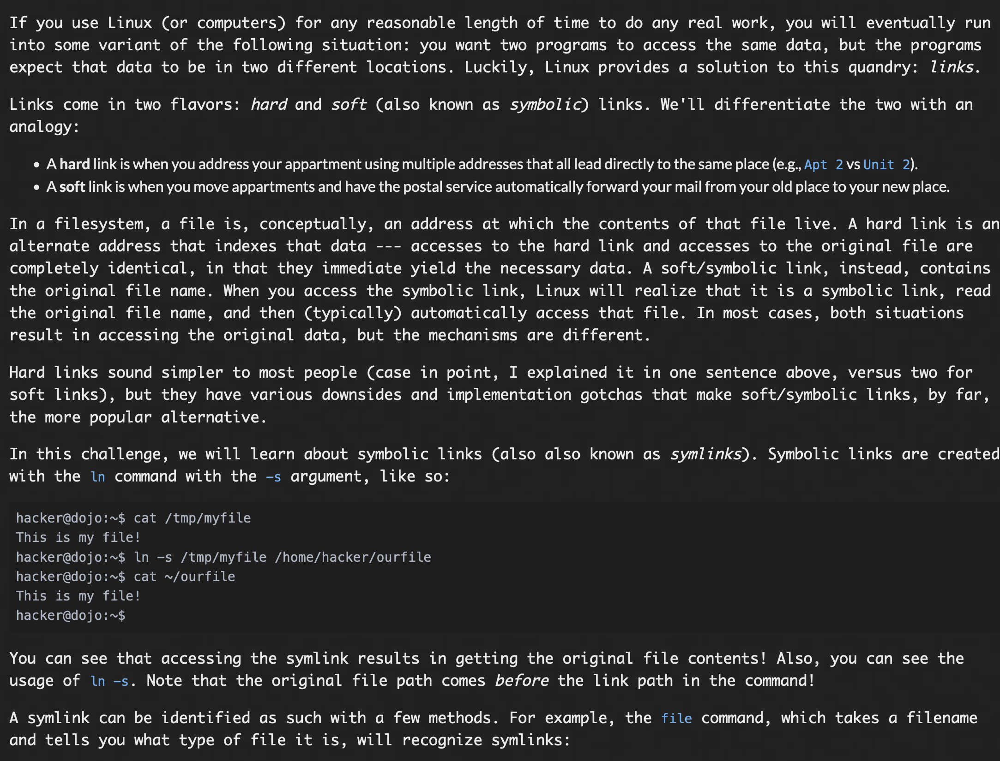
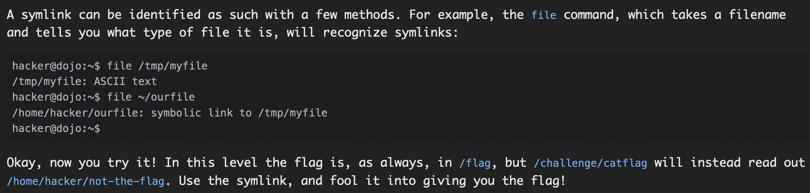

### Solution

a symlink is created between flag and not-the-flag, but ```/challenge/catflag``` reads not-the-flag we force it using -f

so the code executed is 
```ln -sf /flag /home/hacker/not-the-flag```, after this ```/challenge/catflag``` is called which gives the flag.


#### flag: ```pwn.college{IOh-CAEcI7-4V49J6KrTvjh73CS.dlTM1UDL0kTO3czW}```