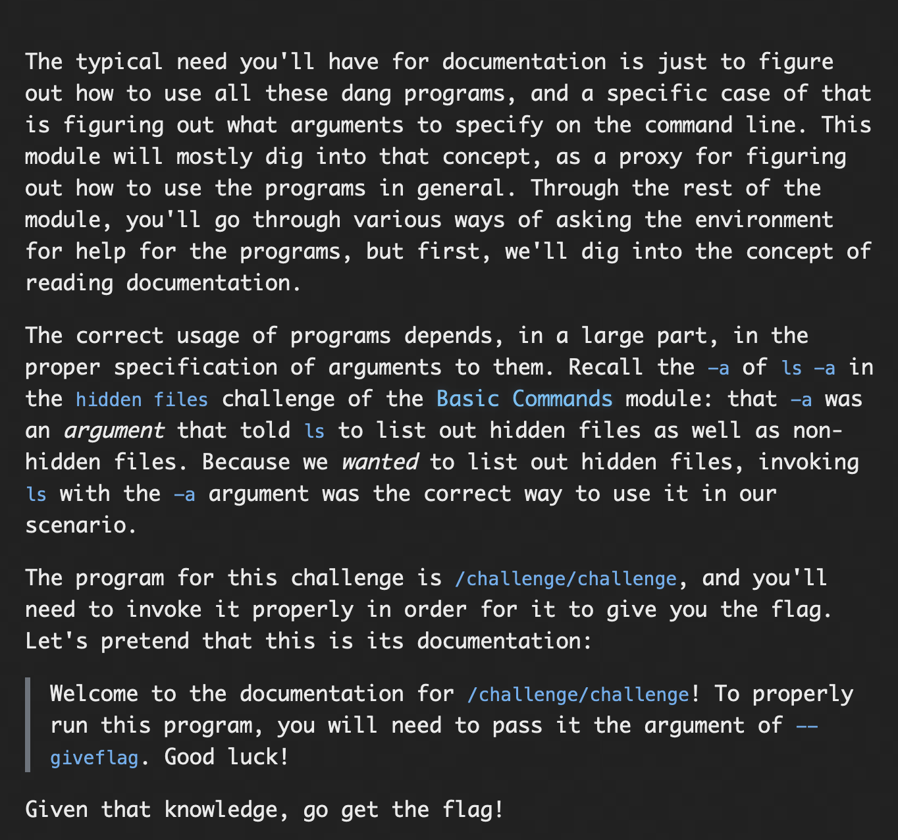
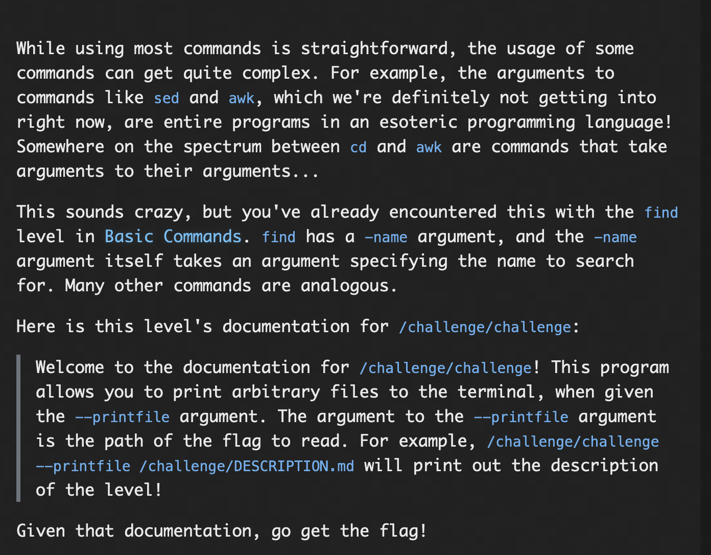
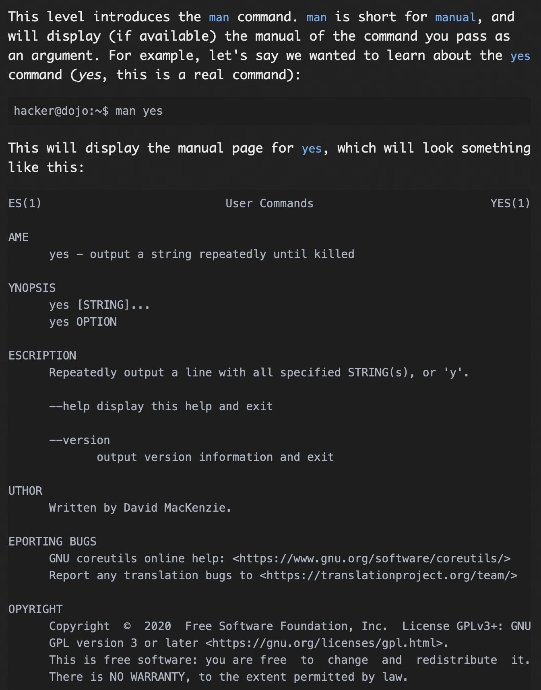
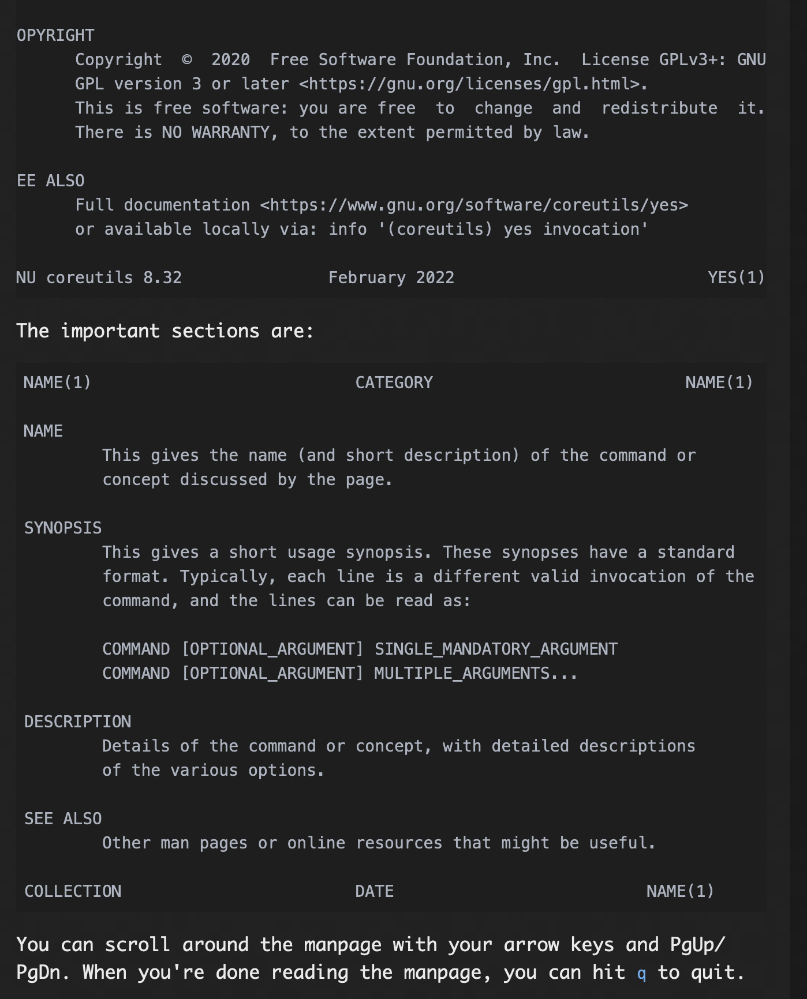
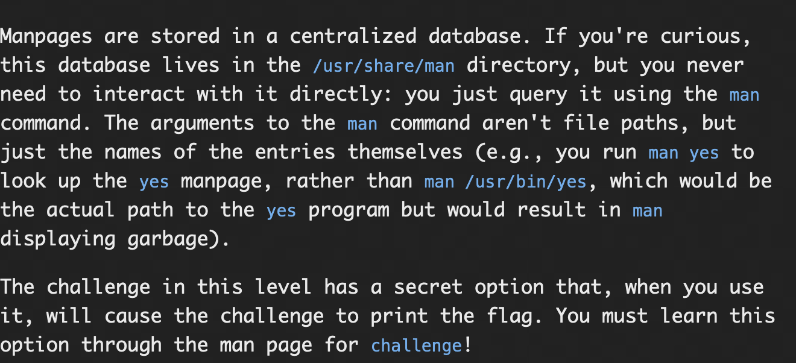
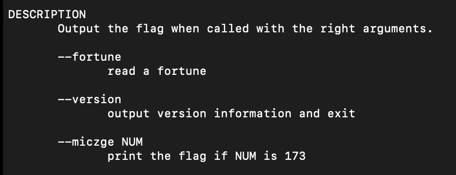
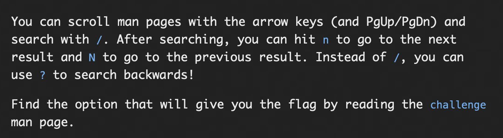
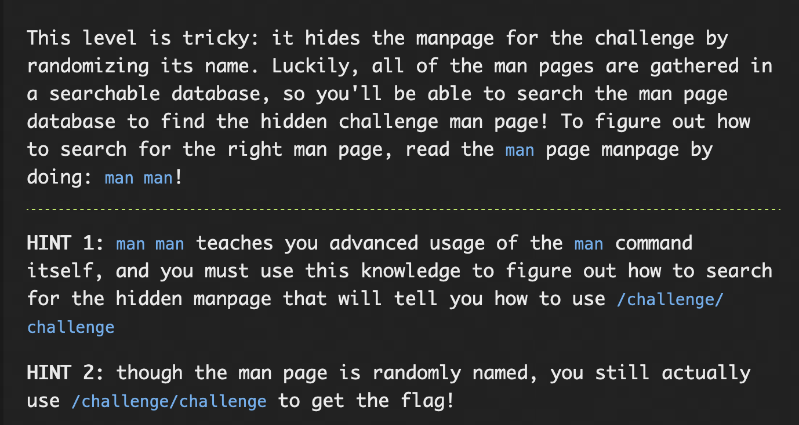
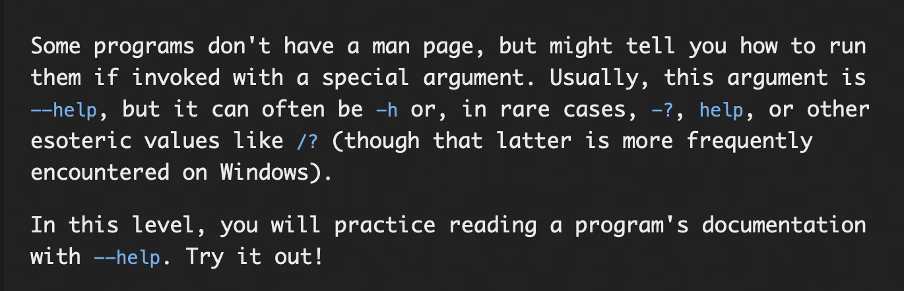
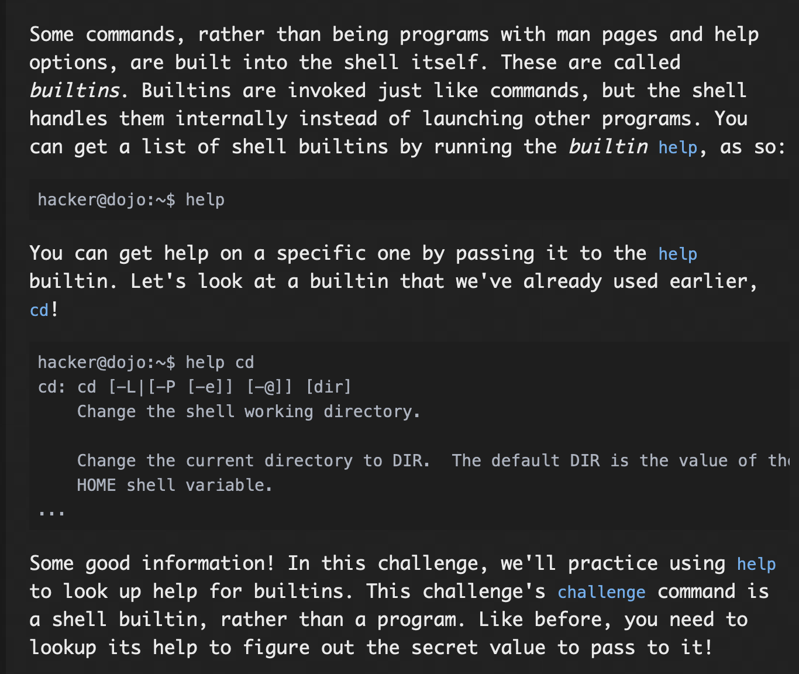

# **Digesting Documents**

## Learning from Documentation

### Problem:



### Solution:

As the Document indicates ```--getflag``` is the argument that should be given to ```/challenge/challenge```, on doing that ```/challenge/challenge --getflag```, we get the flag

#### flag: ```pwn.college{4SWTPLpaNCnXPVldzULa_-nw1uB.dRjM5QDL0kTO3czW}```

## Learning Complex Usage

### Problem:


### Solution:

As the documentation mentioned, we have to give path as argument to ```--printfile```,which is an argument to ```/challenge/challenge```

First i did list all the items in home directory, after that, i saw a flag and not-the-flag as its contents, i gave the command ```/challenge/challenge --printfile ~/flag```, this showed me the command is correct but flag is a directory so i opened the directory using ```ls ~/flag``` which showed there is another file called flag, i the i gave the command ```/challenge/challenge --printfile ~/flag/flag``` which gave me a flag, but the flag was incorrect so i gave the command ```/challenge/challenge --printfile ~/not-the-flag```, which gave me another flag that worked.

#### flag: ```pwn.college{Q5ZScExlzc-9qiByNb1AKQkv5Vh.dVjM5QDL0kTO3czW}```

## Reading Manuals

### Problem:




### Solution: 

On opening the manual for challenge using ```man challege```, we get the the manual and after observing we see that 

in the description section there is an argument for /challenge/challenge command given which when argumented with 173, will give the flag

so by using 

```/challenge/challenge --micze 173``` and passing it to command line i got the flag.

#### flag: ```pwn.college{Mm1iE-Nc_7zZHgTDUe3l-D-8XX6.dRTM4QDL0kTO3czW}```


## Searching Manuals

### Problem:


### Solution:

First, opened the manual using ```man challenge```, then searched the description using ```/flag```, then using 'n' went through the options and found ``` --qcjrijk``` argument for the flag.

so using ```/challenge/challenge --qcjrijk```, I got the flag.

### flag: ```pwn.college{o799vzcABYofEMNssqlW5OirTsK.dVTM4QDL0kTO3czW}```

## Searching for Manuals

### Problem:


### Solution:

First, I did ```man man```, we see the manual for man, after going through it for a while, i found and argument -K that enables us to search for options, so after exiting the manual i entered the command ```man -K challenge```, this gave me another manual and after reading the descrition there, i found ```--wdzarl NUM```, this, after that, i used the ```/challenge/challenge``` command with the argument ```--wdzarl``` and that again argumented with number 856 gave me the flag.

```/challenge/challenge --wdzarl 856```

#### flag: ```pwn.college{wRJ8dz5BYarQXllg-lAi6EiwH5G.dZTM4QDL0kTO3czW}```

## Helpful Programs

### Problem:


### Solution:
First help was given as an argument to ```/challenge/challenge``` using ```/challenge/challenge --help```, this page showed me that -g can be given as argument to get the flag when another argument is used along with it, and -p can be used to get that argument, so using ```/challenge/challenge -p```, I got the argument as 644, then using ```/challenge/challenge -g 644```, I got the flag.

#### flag: ```pwn.college{MIXRQNptKUyuC6ol-xoaea4vGdm.ddjM4QDL0kTO3czW}```

## Help for Builtins

### Problem:


### Solution:
Using the help on challenge builtin, ```help challenge``` , I got the help options, along with a secret value, doing that, I used the other option and passed ```challenge --secret ceRiJlHL```, so this gives me the flag.

#### flag: ```pwn.college{ceRiJlHLsdeBLRly5IhfUnUP96G.dRTM5QDL0kTO3czW}```
