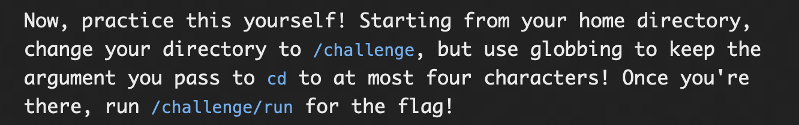

# **File Globbing**

## Matching with *

### Problem:




### Solution:

'*' behaves like wildcard in this in linux command line shell, when '*' is encounterd the teminal tries replacing '*' with the pattern (all the characters at that place and further)

so the challenge asks to go to the ```/challenge``` directory by just passing a four letter argument to cd, so i passed the command ```cd /cha*``` to change the directory for ~ to /challenge, after which on passing ```/challenge/run``` in the terminal i get the flag

#### flag: ```pwn.college{gTpfLWINr1NCmrUix1h9MFDIg_L.dFjM4QDL0kTO3czW}```

## Matching with ?

### Problem:


### Solution:

When '?' is given in the command line shell, it is treated as a single-character wildcard and then looks for the patter 

Similar to Matching with *, the challenge ask to go to ```/challenge``` directory, but instead of c and l we are supposed to use '?' wildcard, when giving argument to cd, so i just change directory using ```cd /?ha??enge``` and then on running the command using ```/challenge/run``` we get the flag.


#### flag: ```pwn.college{4tJTPDTL7NcnPujQJ9Rsauy10Q9.dJjM4QDL0kTO3czW}```

## Matching with []

### Problem:


### Solution:

When we use '[]' the arguments passed inside the braces are a subset of superset of all available characters that may be present while globbing, the arguments passed like this act like they are under or operation

So in this challenge, first we have to go to ```/challenge/files``` directory, so i did that using ```cd /challenge/files```, after that we are supposed to give a multiple arguments to ```/challenge/run``` using '[]' contating b,a,s,h after file_,so thats what i passed in command line using the command ```/challenge/run file_[bash]``` which gave the flag.


#### flag: ```pwn.college{0jUBg9yhZmE2Yfq13KfIJwrze8c.dNjM4QDL0kTO3czW}```

## Matching paths with []

### Problem:


### Solution:

Similar to last time but this time we have to give the command form ~ directory and pass the argument to ```/challenge/run``` as absolute paths

so what i did was pass the command, ```/challenge/run /challenge/files/file_[bash]```, this gave the flag

#### flag: ```pwn.college{EdxPP0rmC8JwFfcxCbGSUUHE-ZX.dRjM4QDL0kTO3czW}```

## Mixing Globs

### Problem:


### Solution:

So, in this challenge, from ```/challenge/files``` directory, we are supposed to pass argument so that it satisfies "challenge", "education" and "pwning" so, first i derected to required directory using ```cd /challenge/files``` then from there i passed the command ```/challenge/run *in*``` which threw an error, telling that we are supposed to use '[]' also, so i passed the command ```/challenge/run [pce]*```, which worked and gave the flag.

#### flag: ```pwn.college{sBQfm8l5qwRpk2dyXibnzNGrXAB.dVjM4QDL0kTO3czW}```

## Exclusionary Globbing

### Problem:


### Solution:

In this case '!' or '^' behaves like a logical not.


This challenge ask to go to the directory files, so thats what i do using the command ```cd /challenge/files``` after which,  we are supposed to use ```/challenge/run``` with the arguments not starting with p,w or n, so i passed the command ```/challenge/run [!pwn]*```, which gave the flag

#### flag: ```pwn.college{kbYWLBYJ5LaA9ZwNfuFy9fJFLte.dZjM4QDL0kTO3czW}```