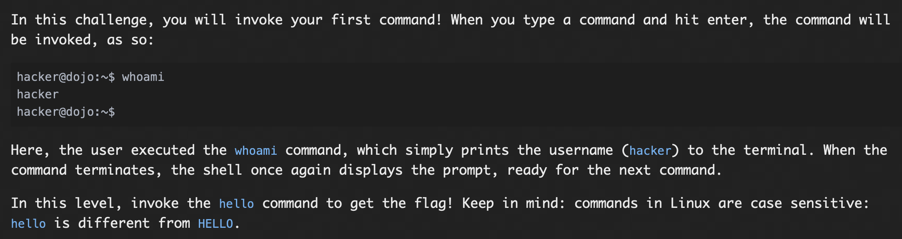
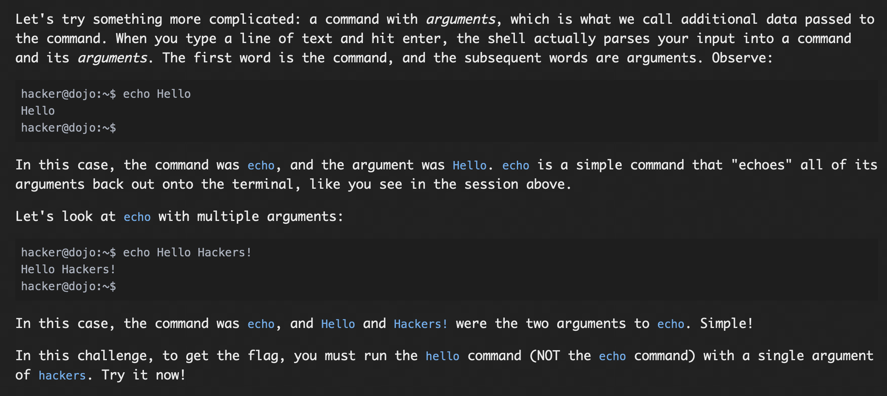

# **Hello Hackers**

## *Intro to commands*


### What is a command?
Commands are basic tools required to interact with unix based operating systems on an individual level!

These commands are used to interact with the shell.


### Problem:




### Solution:
The command ```hello``` is used, which directlyy lends the flag.


#### The flag:   ```pwn.college{wY7Y5W8cyS1BWFCesGoRtQAQK2q.ddjNyUDL0kTO3czW}<br><br>```

<br></br>
## *Intro to Arguments*

## So what are arguments then?

Arguments (or command line arguments) are the arguments that are being passed, may be used to further specify the action.

For Example: mkdir ```directory_1```

here mkdir is the command while directory_1 is an argument to the command.

### Problem:



### Solution:
We were supposed to pass the argument hackers to hello commang, which gave the flag.

The commend used was ```hello hackers```

#### The flag: ```pwn.college{k5D8QnK1xFoKyYohTxNXce8A_KI.dhjNyUDL0kTO3czW}```
