# **Perceiving Permissions**

## Changing File Ownership

### Problem:
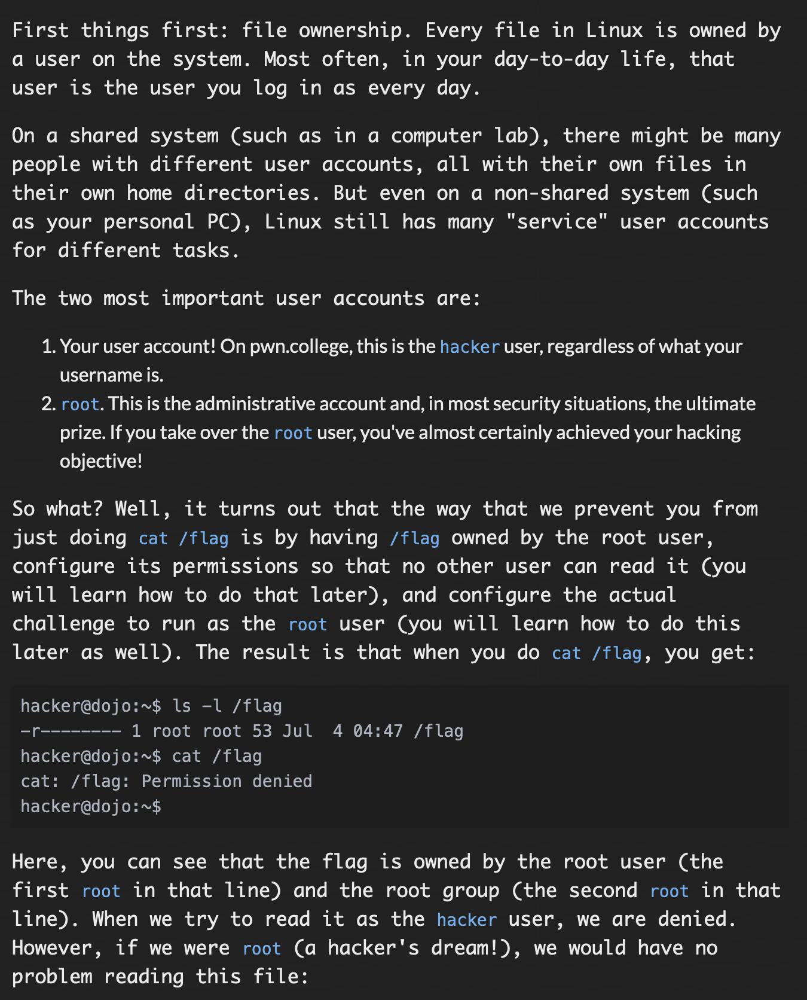
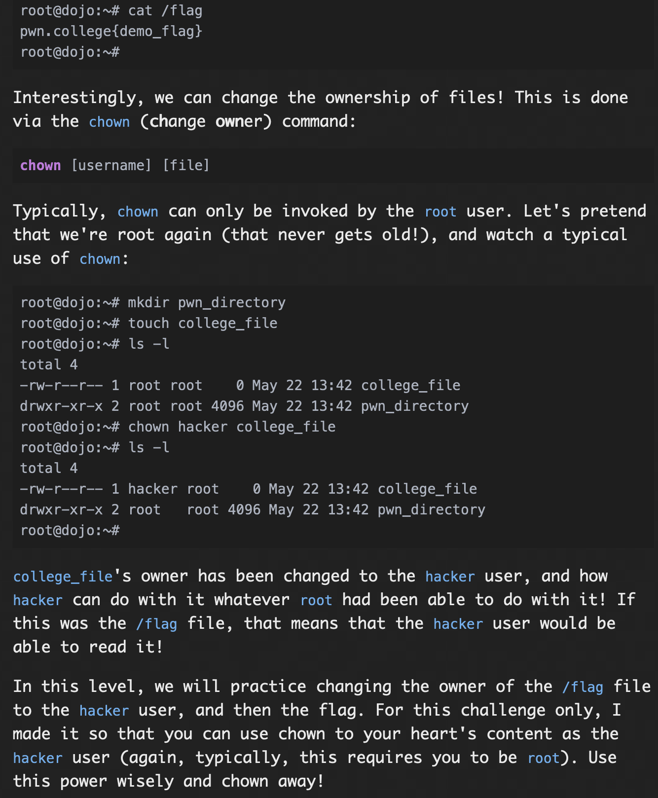

### Solution:

for this challenge, first using the command ```ls -l``` i checked all the files present in the ~ directory, so using, ```cd flag```, i went to flag direcotory, now using ```ls -l```, i checked the ownership of the flag file, which was root, now using changing owner command i changed the ownership to hacker(```chown hacker flag```), then using cat program, i got the flag(```cat flag```), but this flag was incorrect, then i went back to home directory using ```cd ..```, then I observed carefully and saw, that the flag is actually pointed by the file not-the-flag,so i went back to home directory using ```cd ..```, changed the ownership of "/flag" file using the command ```chown hacker /flag```, then using the cat program, i got another flag.(```cat /flag```)

#### flag: ```pwn.college{QVbK_vUbUcq33pyJUMnYkpLs-ZI.dFTM2QDL0kTO3czW}```

## Groups and Files

### Problem:
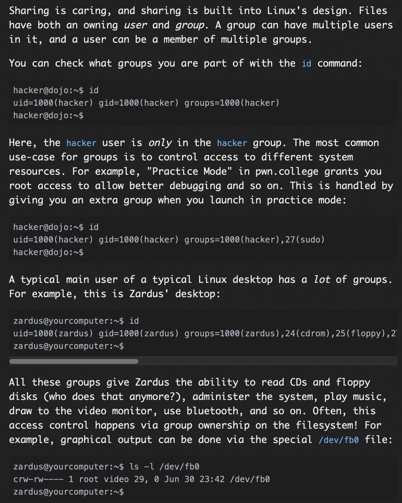
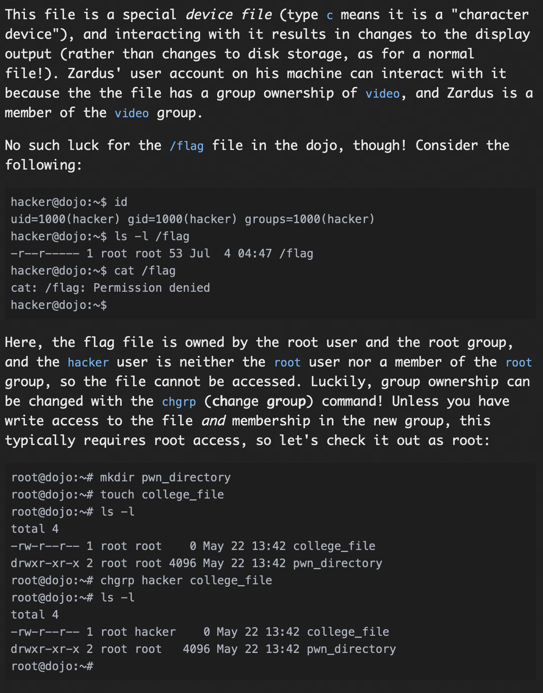
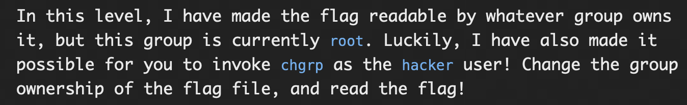

### Solution:

For this challenge, we have to use change group command to change the group form root to hacker so that we can use cat program to read it, so first using the command ```chgrp hacker /flag```, i changed the group to hacker, then using cat program ```cat /flag```, i got the flag.

#### flag: ```pwn.college{M_5HL8cqg9zMuKpylljsuCi9h90.dFzNyUDL0kTO3czW}```

## Fun With Group Names

### Problem:
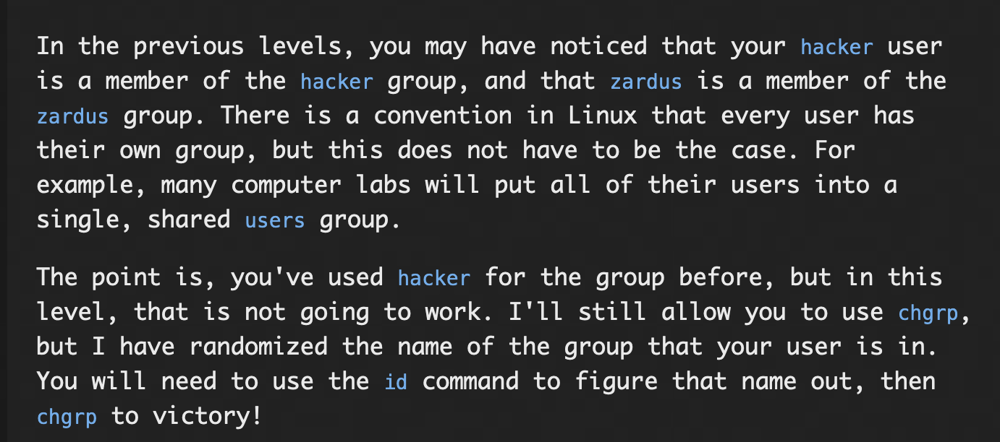

### Solution:

Similar to last challenge, this time just the group name is randomised so we have to see all the available groups using ```id``` program, this gives the group that i have to change to, so using the command ```chgrp grp11493 /flag```, i change the group to the required group then using cat program (```cat /flag```) i got the flag.

#### flag: ```pwn.college{c4-6lKTybvZGIvnHtTS2R8pU_vc.dJzNyUDL0kTO3czW}```

## Changing Permissions

### Problem:
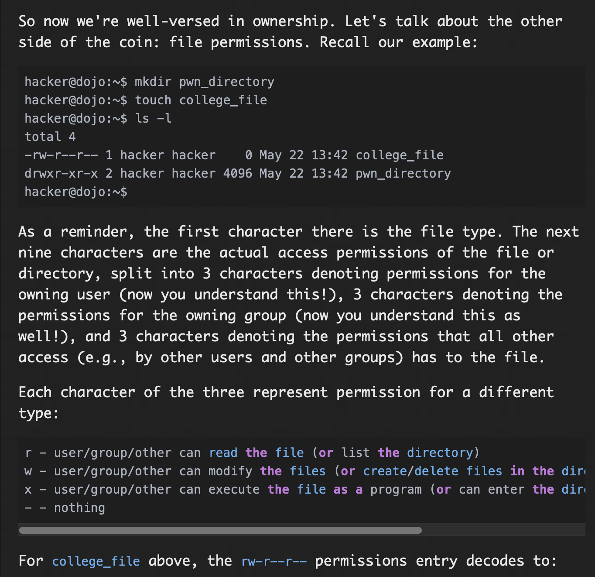
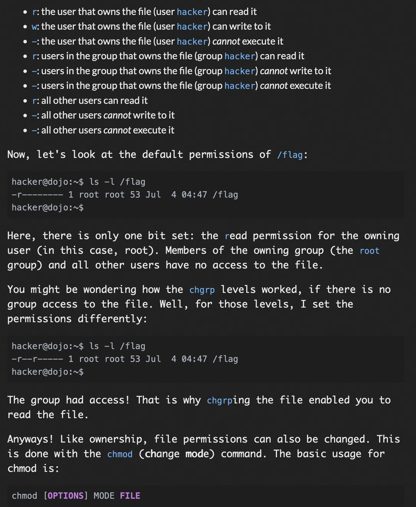
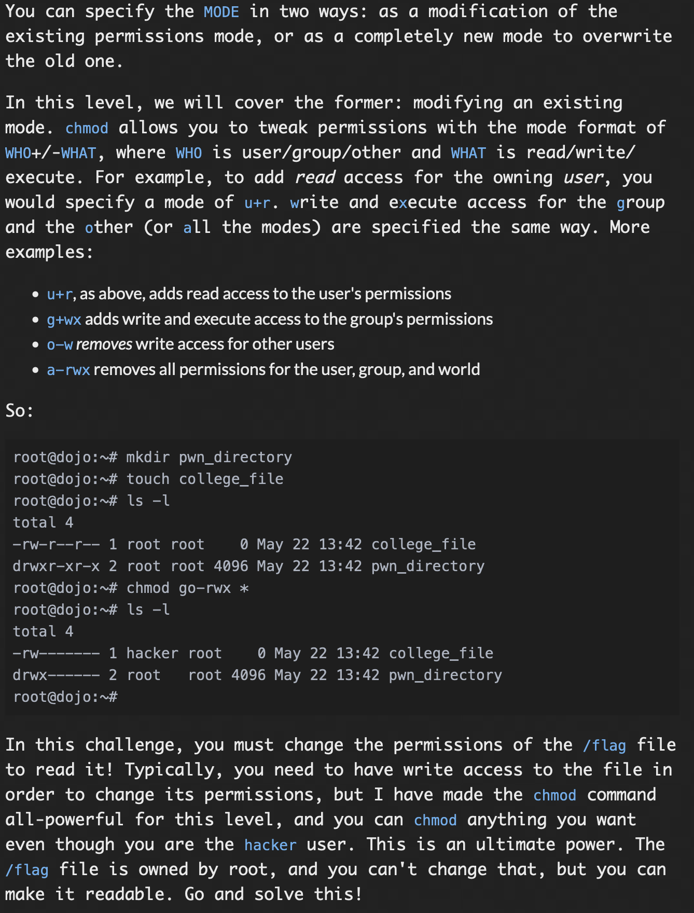

### Solution:

For this challenge, i first checked the permission for /flag file, then I changed it using change mode command ```chmod a+rwx /flag```, gave all the permission for convenience sake. then using the cat command I got the flag.(```cat /flag```)

#### flag: ```pwn.college{wj4fV8-B27lrEr-v2tpN3j0G5AE.dNzNyUDL0kTO3czW}```

## Executable files

### Problem:
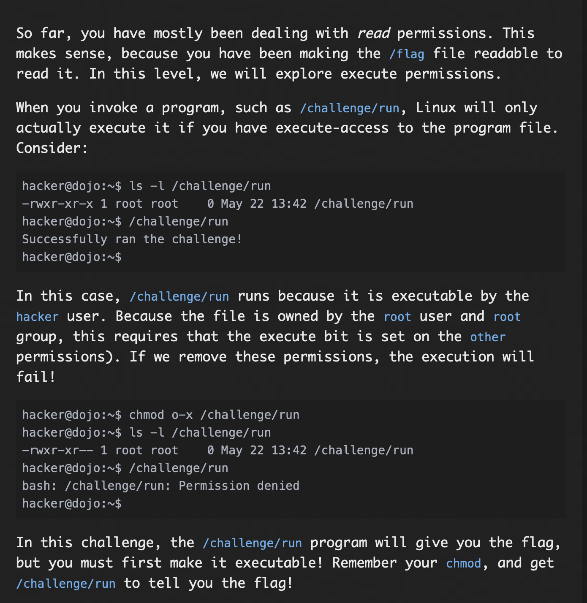

### Solution:
For this challenge, i first checked the permissions for /challenge/run file using the command ```ls -l /challenge/run```, then after this, I changed the mode to executable for the other user field using the command ```chmod uo+x```, the again checked the permissions(```ls -l /challenge/run```), then finally executed the command using ```/challenge/run```

**Note** Since the root user does not have the execution permission, we have to grant the permission to the root user as well as the other user, giving execution permission to just other user wont work

#### flag: ```pwn.college{0HExcFchk91nvHXLCzcB6QzAk4a.dJTM2QDL0kTO3czW}```

## Permission Tweaking Practice

### Problem:

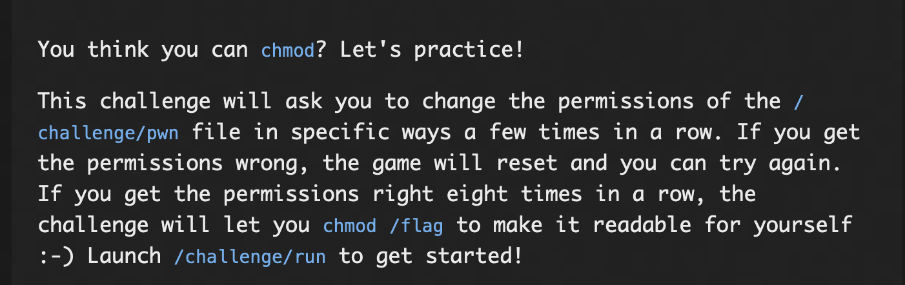

### Solution:

For this challenge we were supposed to solve a challenge first, we had to change the permission of the /challenge/pwn file according to whatever asked , so thats what i did the commands used were:
```chmod g-r /challenge/pwn```

```chmod a+rwx /challenge/pwn```

```chmod u-r /challenge/pwn```

```chmod u+r /challenge/pwn```

```chmod a-x /challenge/pwn```

```chmod ug+x /challenge/pwn```

```chmod o-r /challenge/pwn```

```chmod u-r /challenge/pwn```

Now the ownership for the flag file is with hacker, now i used the command ```chmod uo+r /flag```, to give the read permission to other user(can't be done without giving it to user u), after that I used the cat program to read the file /flag using ```cat /flag```, this gave the flag.

#### flag: ```pwn.college{E8pS84xJBEUsNpf432NYTxHFtEL.dBTM2QDL0kTO3czW}```

## Permission Setting Practice

### Problem: 
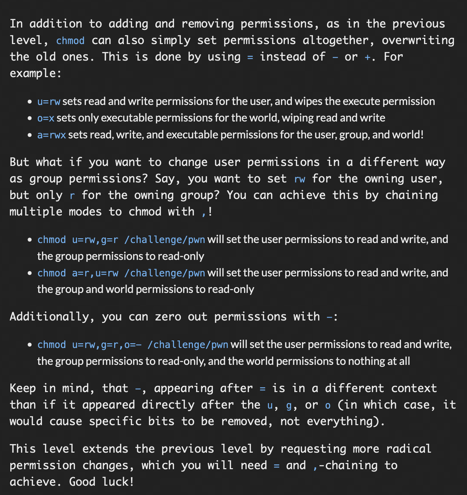

### Solution:
when '=' is used, the permissions are reset for that perticular user, similar to last question we use the following commands to pass the challenge

```chmod u=wx,g=-,o=wx /challenge/pwn```

```chmod u=rw,g=rx,o=rw /challenge/pwn```

```chmod u=-,g=rx,o=rw /challenge/pwn```

```chmod u=x,g=r,o=x /challenge/pwn```

```chmod u=wx,g=w,o=r /challenge/pwn```

```chmod u=wx,g=rwx,o=rw /challenge/pwn```

```chmod g=rx,o=rwx /challenge/pwn```

```chmod u=w,g=-,o=rx /challenge/pwn```

Now the ownership for the flag file is with hacker, now i used the command ```chmod u=r,o=r /flag```, to give the read permission to other user(can't be done without giving it to user u), after that I used the cat program to read the file /flag using ```cat /flag```, this gave the flag.

#### flag: ```pwn.college{QxordHHm6EsaX8dNqxIABVjsp9e.dNTM5QDL0kTO3czW}```

## The SUID Bit

### Problem:
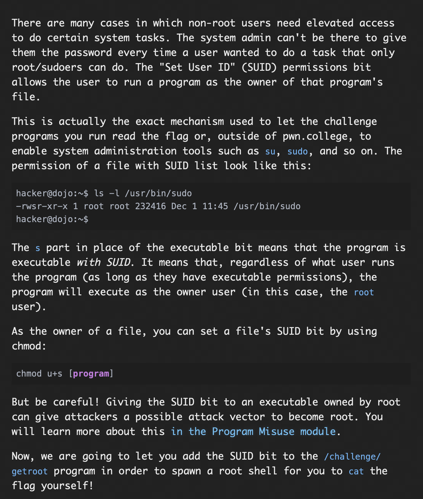

### Solution:

For this challenge, we first set the suid bit using the command ```chmod u+s /challenge/getroot```..then on running ```/challenge/getroot```, our shell runs as a root now, now using the command ```cat /flag```, we get the flag.

#### flag: ```pwn.college{IeF6ae0WKF802vtlRDZJRgf6CMr.dNTM2QDL0kTO3czW}```