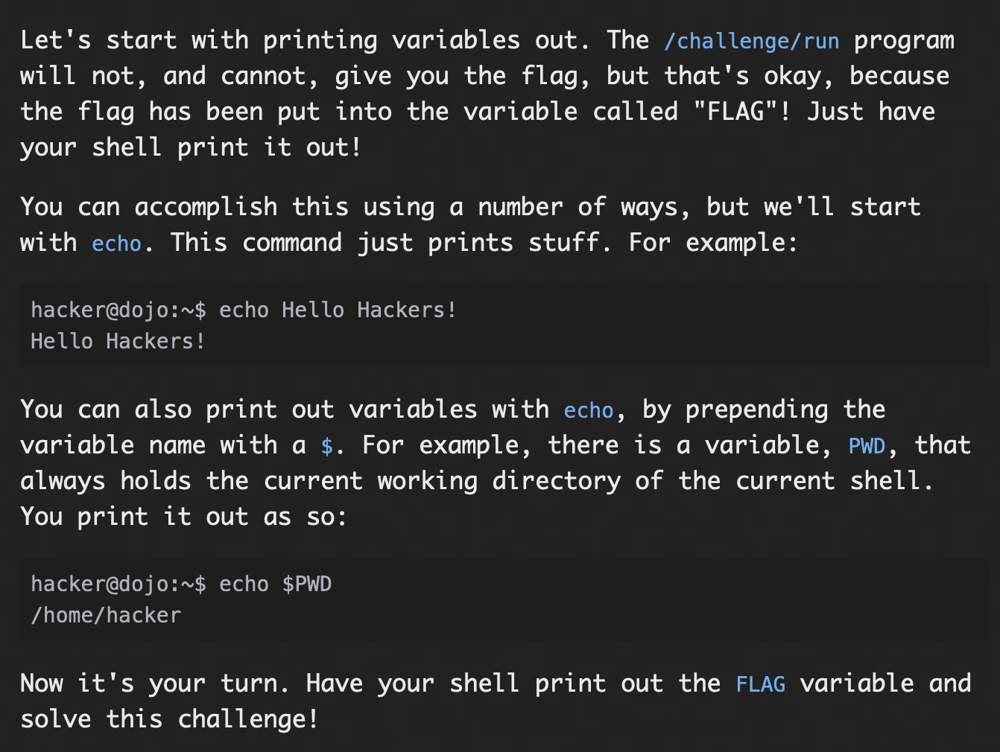
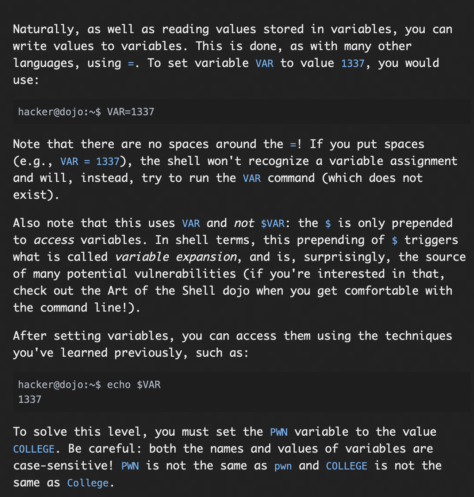
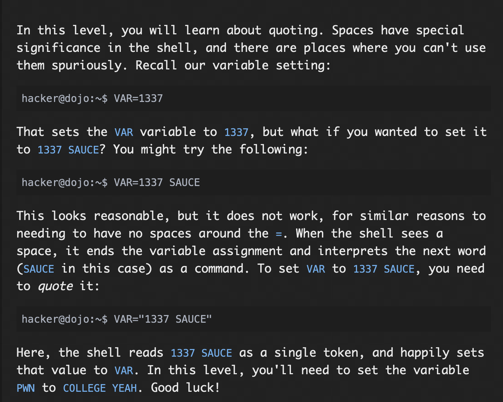
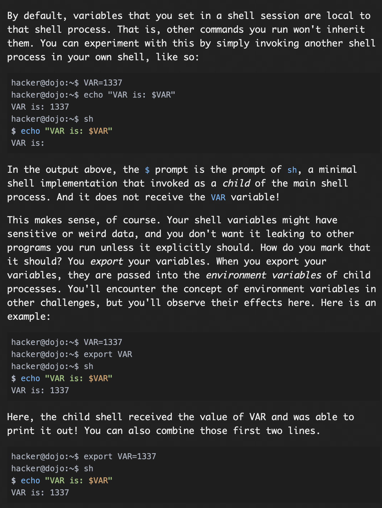
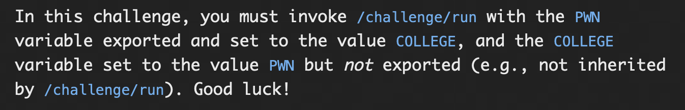
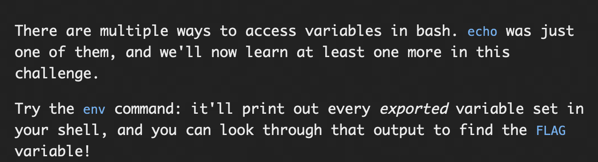
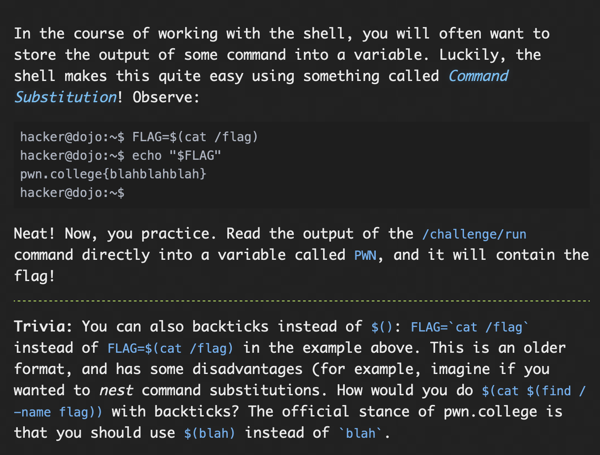
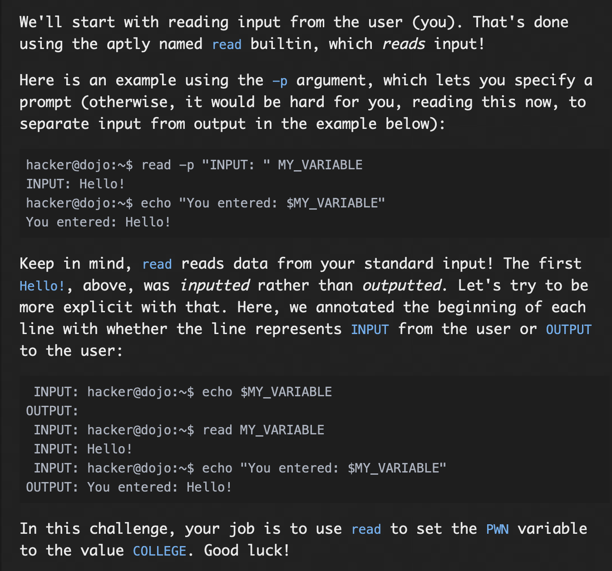
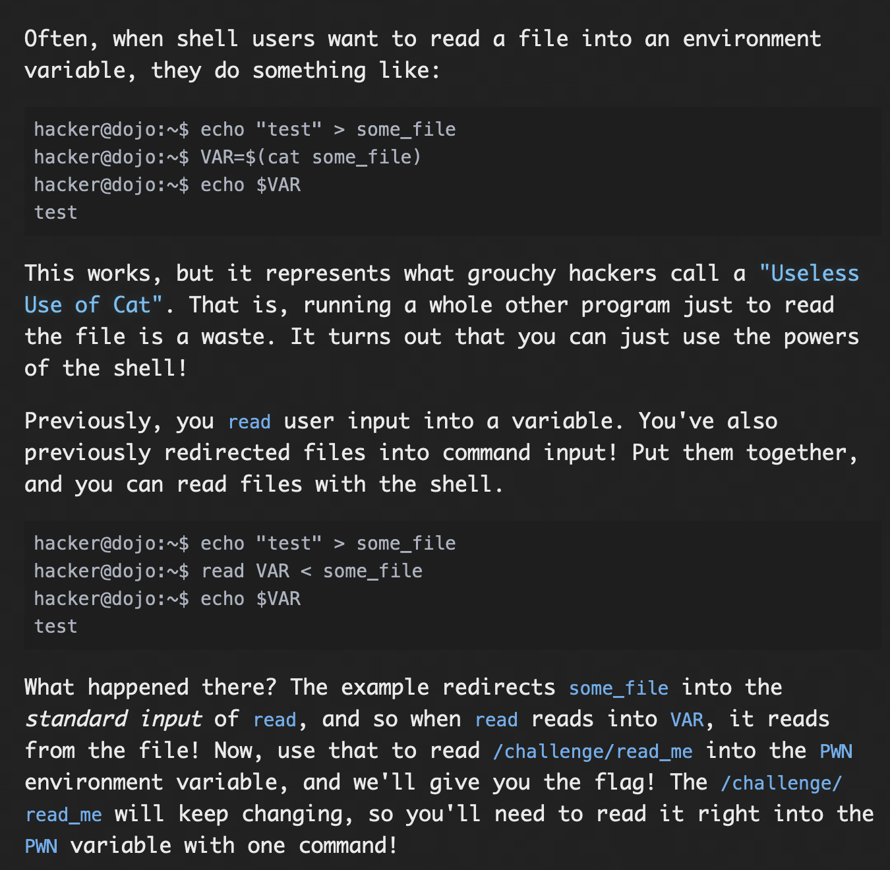

## **Shell Variables**

## Printing Variables

### Problem:


### Solution:

For this challenge, just printing the variable "FLAG" using ```echo $FLAG```, prints the flag.

Prepending with '$' triggers variable expansion, thats why it is used during execution
#### flag: ```pwn.college{M1HkVU12FW88cLvWpTzKiqeSBvQ.ddTN1QDL0kTO3czW}```

## Setting Variables

### Problem:


### Solution:

On assigning the value "COLLEGE" in the variable "PWN", i got the flag. Command used: ```PWN="COLLEGE"```

#### flag: ```pwn.college{Y3-xrai2a3ojroC_7zd8ecAgUL0.dlTN1QDL0kTO3czW}```

## Multi-word Variables

### Problem:


### Solution:

For this challege, assigning "COLLEGE YEAH" to "PWN" gives the flag. command used: ```PWN="COLLEGE YEAH"```

#### flag: ```pwn.college{A_id4nH7UysZP1KbC_ZyK9hi2y2.dBjN1QDL0kTO3czW}```

## Exporting Variables

### Problem:



### Solution:

Here, the local variable "COLLEGE" holds the value "PWN" using the command ```COLLEGE="PWN"```, then using the command ```export PWN="COLLEGE"```, we set the value of "PWN" to "COLLEGE", which is then exported. Now, after this the variable "PWN" is given as an argument to ```/challenge/run``` using the command ```/challenge/run PWN```, which gives the flag.

#### flag: ```pwn.college{4TW-4NpaNzfFno9mPD5H-OfZXvb.dJjN1QDL0kTO3czW}```

## Printing Exported Variables

### Problem:


### Solution:
using the  ```env```, command gave the values of a lot of variables. instead of looking manually through it, i piped the output of env to grep searching for the string "pwn". I found the flag.

The command used: ```env | grep pwn```


#### ```pwn.college{4hJQ4gt92we883Tvizrq8dVId-w.dhTN1QDL0kTO3czW}```

## Storing Command Output

### Problem:



### Solution:

In this challenge, we are supposed to store the output of ```/challenge/run``` in the variable "PWN" using the command ```PWN=$(/challenge/run)```, then it can be echoed as it stores the flag using ```echo $PWN```.

**NOTE:**We can use ```PWN=`/challenge/run` ``` to store the value too, but its not prefered as nesting if required will not be possible.

#### flag: ```pwn.college{4dhmL1iTrlh0sJhn3SIXXPLzeye.dVzN0UDL0kTO3czW}```

## Reading Input

### Problem:


### Solution:

For, this challenge, we are just supposed to set the value of the "PWN" to college using user input, this can be  achieved using the following command

```read -p "enter value" PWN``` then enter value as college ```enter valueCOLLEGE```, this gives the flag.

#### flag:```pwn.college{QdH65ZB3IVrhGLLqx9plKGZ5KEZ.dhzN1QDL0kTO3czW}```

## Reading Files

### Problem:


### Solution:

For this challenge, we are just supposed to read into environment variable(PWN) by redirecting the stdin of a file, this can be done using the command :
```read PWN < /challenge/run```

This gives the flag.

#### flag: ```pwn.college{ACIua_sHhj4Abm0lB_rJilEk9mA.dBjM4QDL0kTO3czW}```