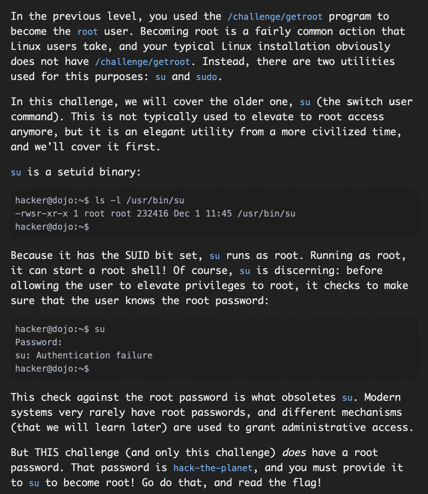
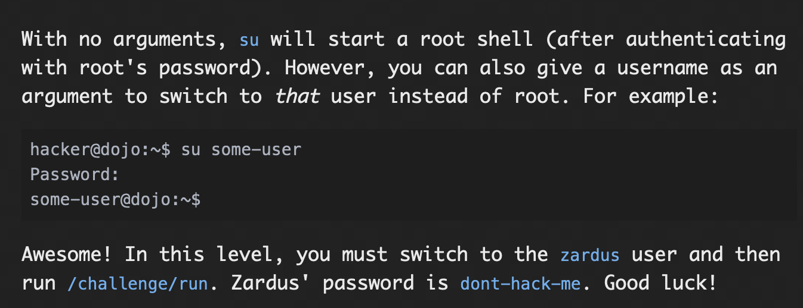
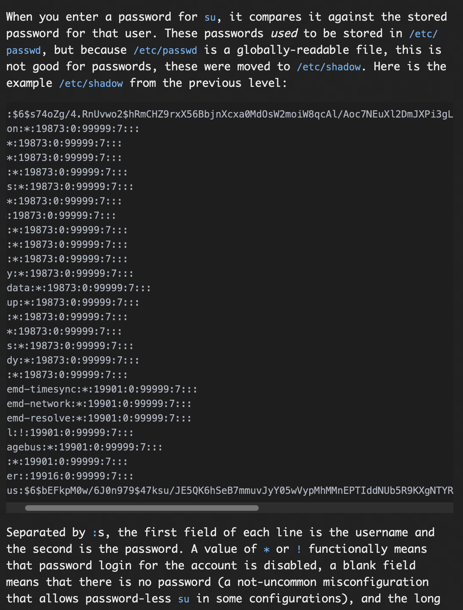
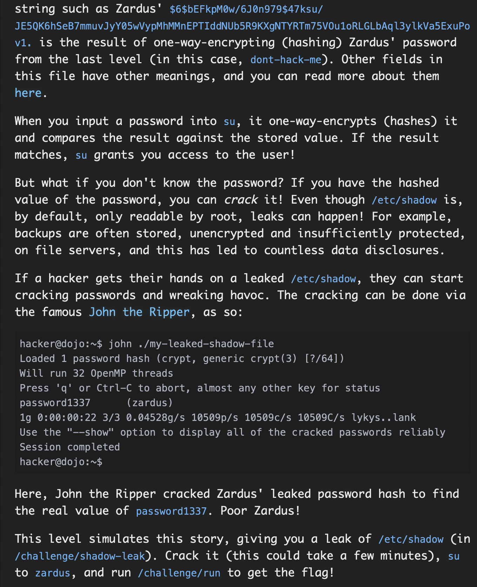
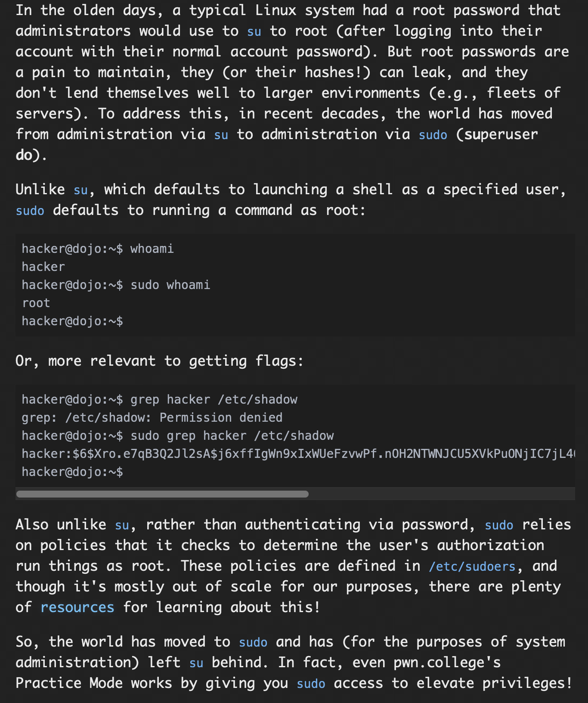
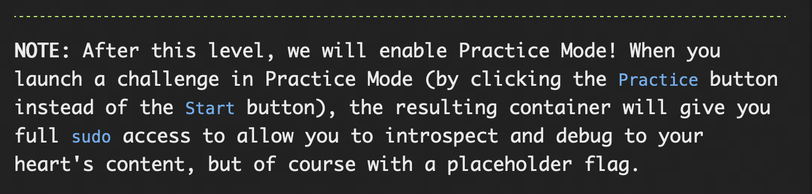

# **Untangling Users**

## Becoming Root with su

### Problem:


### Solution:
For this challenge, we just have to take root access using the switch user command, we do it by the command ```su```, then it ask for the password for root, that we give as "hack-the-planet", then we get the root access for the terminal, then by using ```cat /flag``` command we read the flag file, that gives us the flag.

#### flag: ```pwn.college{8UjkhjuLtj_Ce4HadnZpzmVeSwP.dVTN0UDL0kTO3czW}```


## Other users with su

### Problem:


### Solution:
for this challenge we have to switch to "zardus" user to we use the su command ```su zardus```, then give the password "dont-hack-me", we get the terminal access for zardus, then we use ```/challenge.run``` to get the flag.

#### flag: ```pwn.college{cNR0JSsVmOKfZdaFRcqw47U3XEs.dZTN0UDL0kTO3czW}```

## Cracking passwords

### Problem:



### Solution:

For this challege, we have the shadow file, we give it to JOHN THE RIPPER, John decrypts the password then using --show tag we get the proper password.

```john /challenge/shadow```

```john /challenge/shadow --show```

this gives the password as "aardvark", then using switch user we switch to zardus user, using ```su zardus```, then using the password we just got we get his terminal access, then we give the command ```/challenge/run```, this gives the flag.

#### flag: ```pwn.college{oT8NG6lxFJOWVKvIovCkRYx9HM8.ddTN0UDL0kTO3czW}```

## Using sudo

### Problem:



### Solution:
For this challenge, you just have to give sudo access to cat program that reads the file /flag present in root.

command:- ```sudo cat /flag```

#### flag: ```pwn.college{c0io51KNOi-Yd29JqFYA8jRmqgu.dhTN0UDL0kTO3czW}```