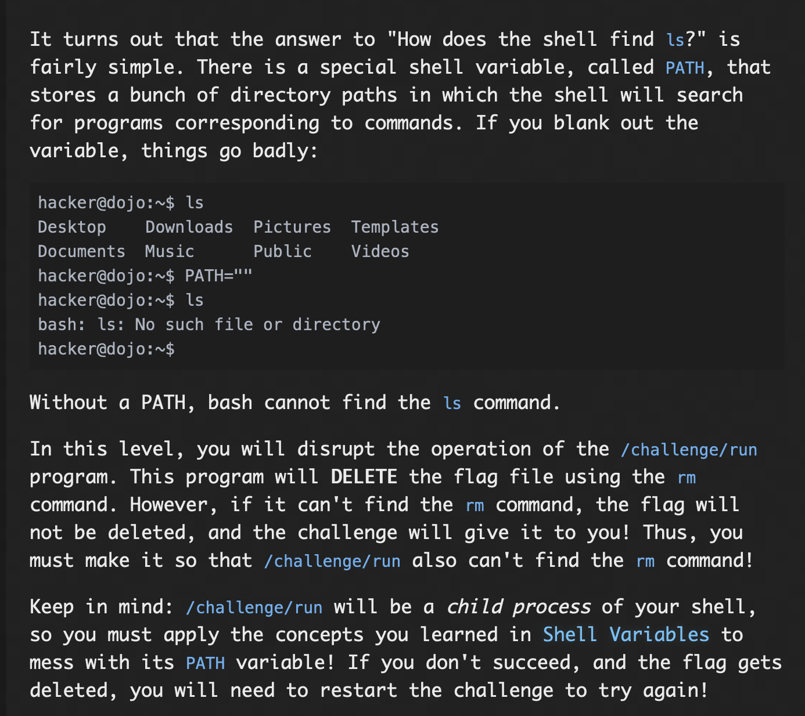
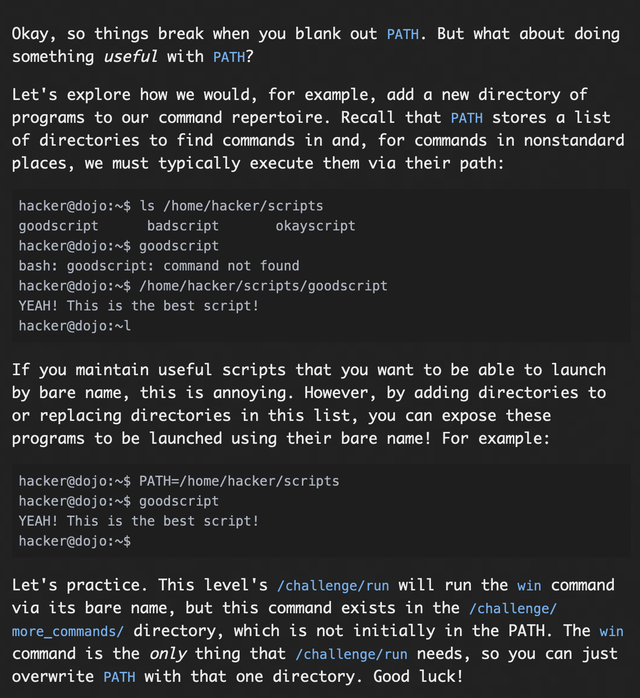
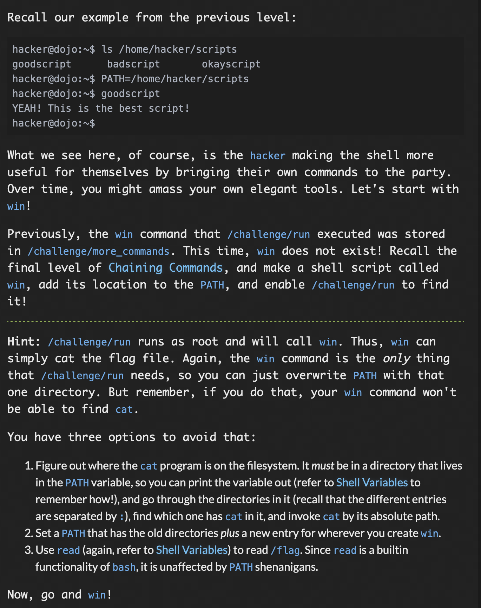
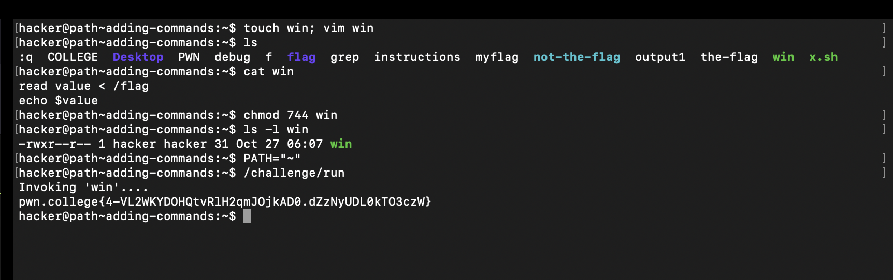
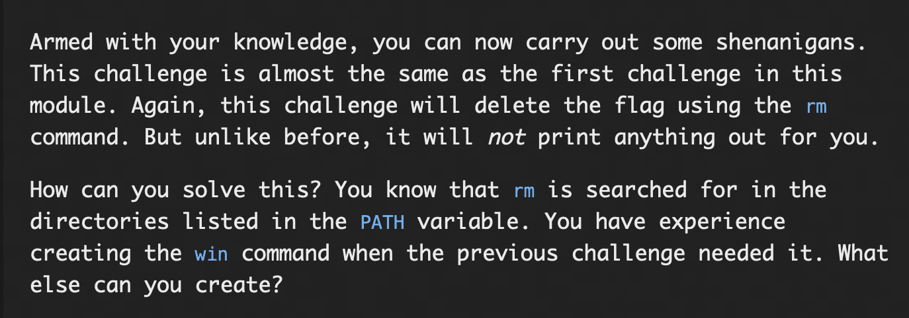
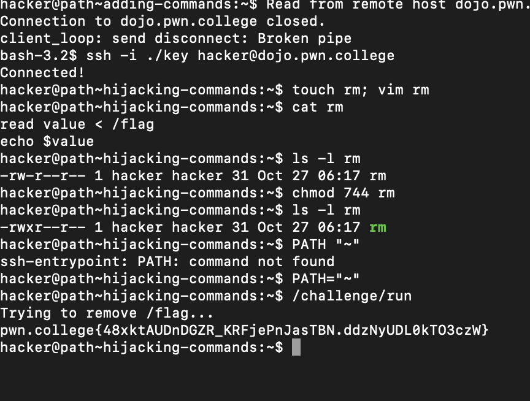

# **Pondering PATH**

## The PATH variable

### Problem:


### Solution:

For this problem, using the commad ``` echo $PATH```, i see the value of env, then rewrited it using the command ```PATH=""```, then checked the value of PATH again using ```echo $PATH```, then I executed the ```/challenge/run```, program which gave the flag..

#### flag: ```pwn.college{kDxBWWWRenOSUPRjvAxrBEDl6cL.dZzNwUDL0kTO3czW}```

## Setting PATH

### Problem:


### Solution:
For this challenge, i first set the PATH variable value to the absolute path of win command using ```/challenge/more_commands```, this can be done using the command ```PATH=/challenge/more_commands```, then ran ```/challenge/run``` this in turn envoked the command win, which gave the flag.

#### flag: ```pwn.college{Yu4MsT2V521Osqkm-qFLQZkGfNa.dVzNyUDL0kTO3czW}```

## Adding Commands

### Problem:



### Solution:

For this challenge, I used the read approach, since echo and read are builtin's we dont have to worry about path at all, so what i did is 

first,
```touch win;vim win```

created a file win and opened it using vim, then after that in insert mode i used to builtin read to pipe the input from /flag file...and stored it in a variable value, now since, read and echo, are builtins, we dont have to worry about their paths in the PATH variable, so then I used ```ls -l```, check the permissions of win file, changed it to execute user also by using the command ```chmod 744 win```, then I changed the value of PATH variable using the command ```PATH="~"```, then I envoked the command ```/challenge/run```, which inturn envoked the command ```~/win```, (internally), which internally echoed the contents of ```value``` variable., this gave me the flag.



#### flag: ```pwn.college{4-VL2WKYDOHQtvRlH2qmJOjkAD0.dZzNyUDL0kTO3czW}```

## Hijacking Commands

### Problem: 


### Solution:

for this challenge, since we know ```/challenge/run``` is going to envoke rm, so what i did is i created my own rm command ```touch rm; vim rm```, in vim editor, i gave the command similar to last time, using read and echo builtin, i copied the contents of flag in a variable value then printed it using echo
```read value < /flag```, ```echo $value```, then i exited vim, after this I changed the permission of rm to executable using ```chmod 744 win```, now changed the path to home so using ```PATH="~"```, this way now ```/challenge/run``` won't be able to locate original rm command, and will execute mine. 

Then I finally executed ```/challenge/run```, command which gave me the flag.
(inturn it executes rm command (my version), which similar to last challenge using builtins prints the value of flag from the variable value)

#### flag: ```pwn.college{48xktAUDnDGZR_KRFjePnJasTBN.ddzNyUDL0kTO3czW}```

