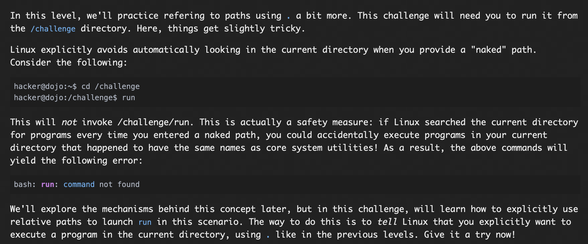

# **Pondering Paths**

## The Root

Linux file system is basically a tree, with ```/``` being the root of the tree.(the start point)...

A program can be invoked by giving the path in command-line.

### Problem:


### Solutions:
The path to the root is given in command-line, which gives the flag.

#### flag: ```pwn.college{Y8ipCM2u0UWGxvjxXSuNnej47Vb.dhzN5QDL0kTO3czW}```


## Program and absolute paths

### Problem:


### Solution:
The absolute path to challenge is given in command-line which gives the flag.

#### flag: ````pwn.college{oT2jRZGfRtrNlgVFC7O-G-TdM3T.dVDN1QDL0kTO3czW}````


## Position thy self

### Problem:


### Solution:
First the challenge asked us to change directory to ```/usr/include```, then path to ```/challenge/run``` is given in command line. This gives the flag.

#### flag: ```pwn.college{k9cpZuBnAvuFpAvZTDLsSUYz3Sq.dZDN1QDL0kTO3czW}```


## Position elsewhere

### Problem:


## Solution:
First the challenge asked us to change directory to ```/sys```, then path to ```/challenge/run``` is given in command line. This gives the flag.

#### flag: ```pwn.college{YtnF_aSx8KWJGURcT9Ah1Sxu3d_.ddDN1QDL0kTO3czW}```

## Position yet elsewhere

### Problem:


### Solution:
First the challenge asked us to change directory to ```/sys/kernel```, then path to ```/challenge/run``` is given in command line. This gives the flag.

#### flag: ```pwn.college{cTewDh5PjDoO8nmPjRQyceK172S.dhDN1QDL0kTO3czW}```

## Implicit, relative paths, from /

### Problem:


### Solution:

First we go to root(/) directory, then relatively path ```challenge/run```
is given to command-line, this gives the flag.

#### flag: ```pwn.college{oKFUqNCvztqFhEe8L12E-29Gv3i.dlDN1QDL0kTO3czW}```

## Explicit Relative paths, from /

### Problem: 


### Solution:

From the root directory, ```./challenge/run``` is given, which gives the flag.

we are explicitly asking the flag from root using ```.``` which is implicitely refering to the same root directory.

#### flag: ```pwn.college{IwEvbRYjeHnar2ETIl-hKz4Lr39.dBTN1QDL0kTO3czW}```


## Implicit Relative Path

### Problem:


### Solution:

First we go to ```/challenge``` directory using cd command and then using implicit reference we run the run command ```./run```

#### flag: ```pwn.college{EmpTv0QHFTt_6GMq-2ouPpf0rgn.dFTN1QDL0kTO3czW}```

## home sweet home

### Problem:


### Solution:
```/challenge/run ~/f``` is called as, we need to specify the absolute path where the flag will be written , and the flag is written in f in this case.

~ depicts /home/hacker directory basically the home directory

#### flag: ```pwn.college{EO57ynwCT_kktqf5MJrfi59OELp.dNzM4QDL0kTO3czW}```