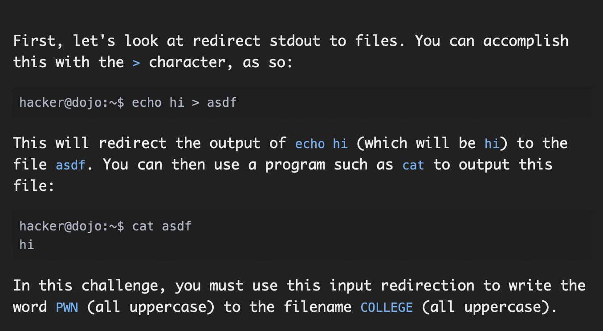
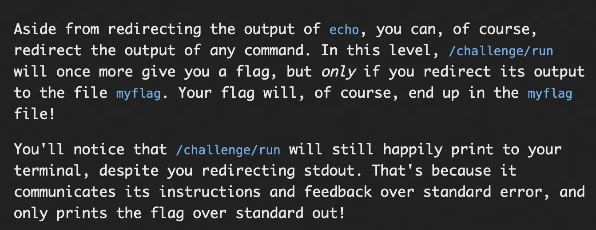
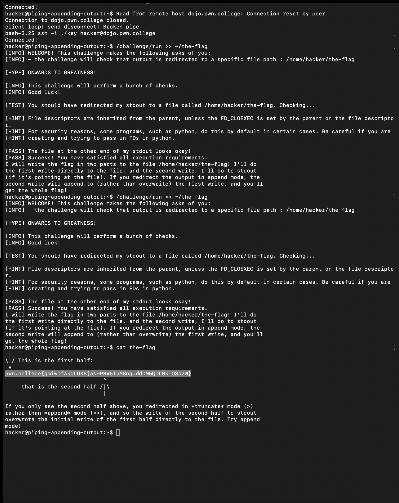
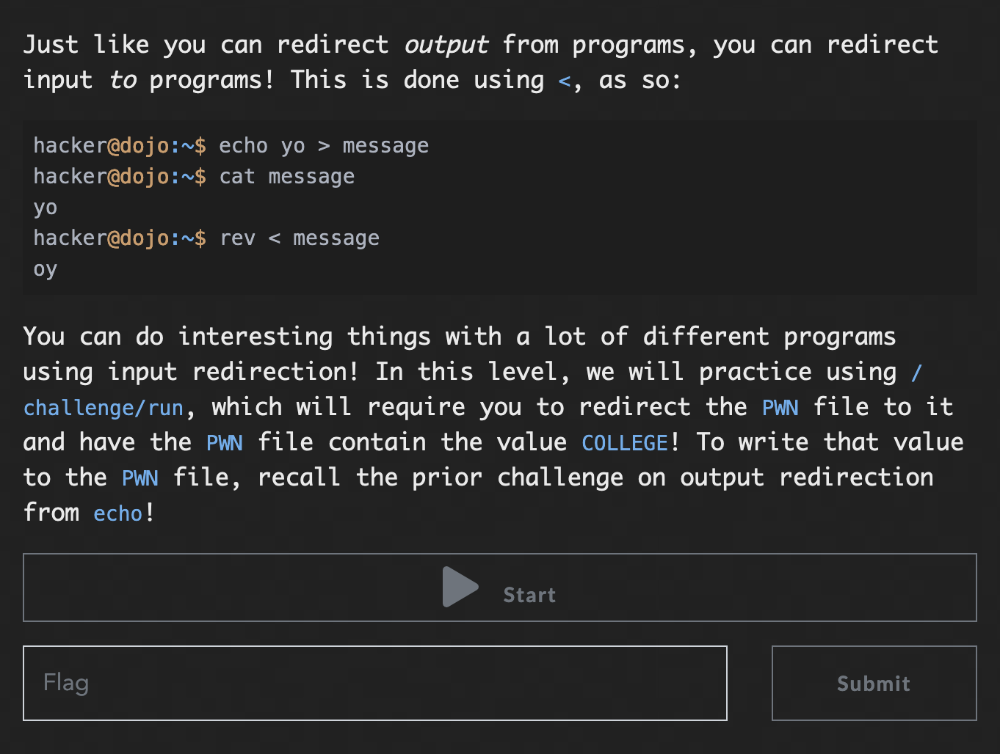
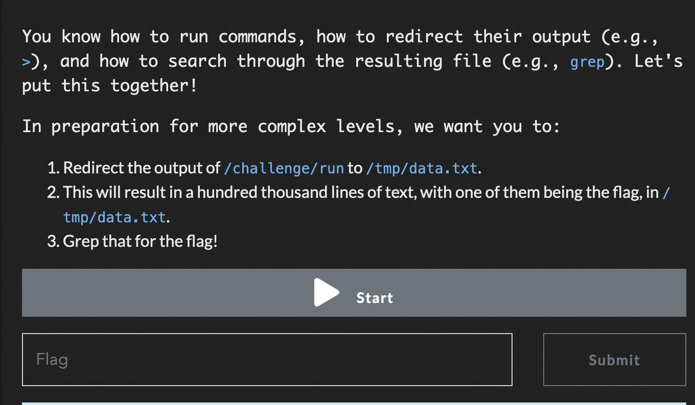
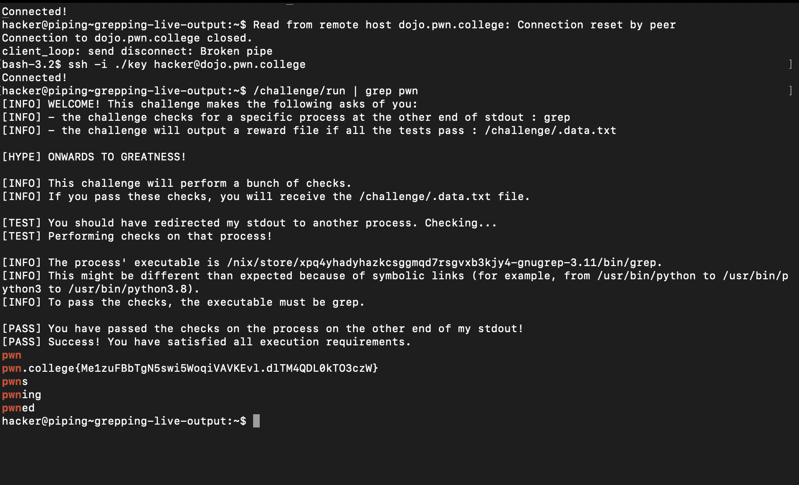
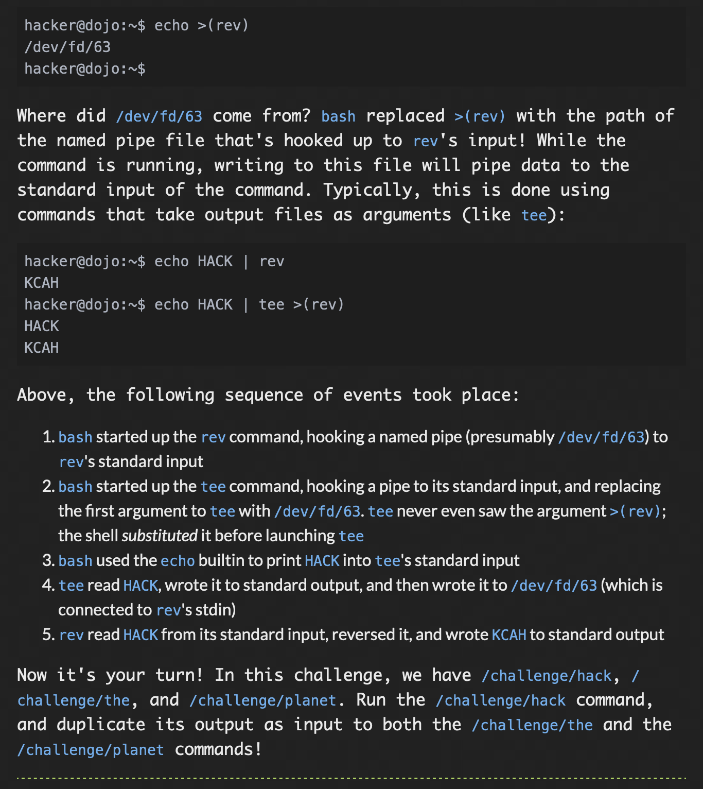
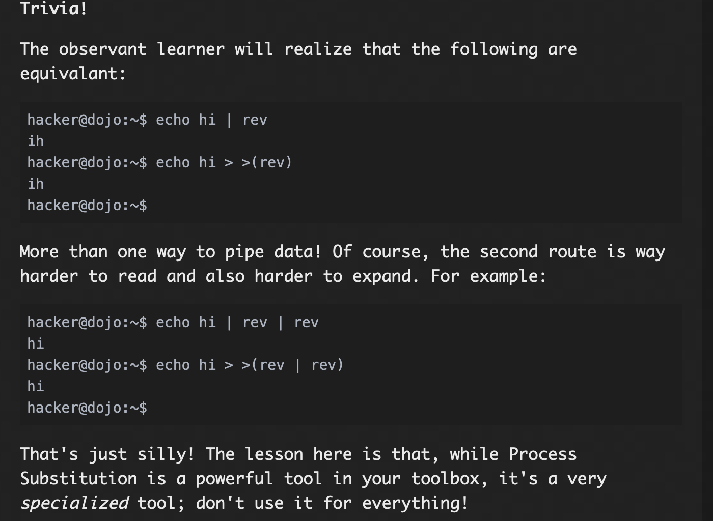
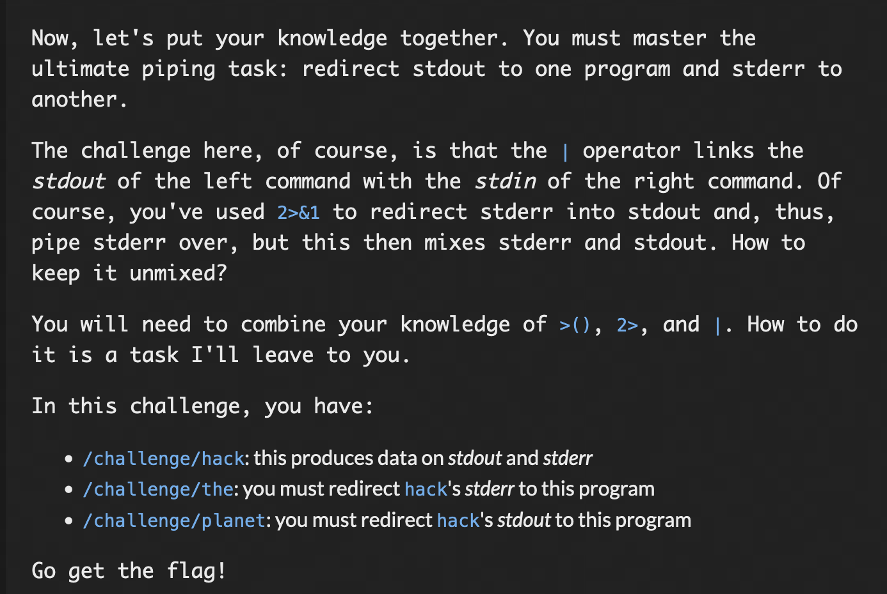
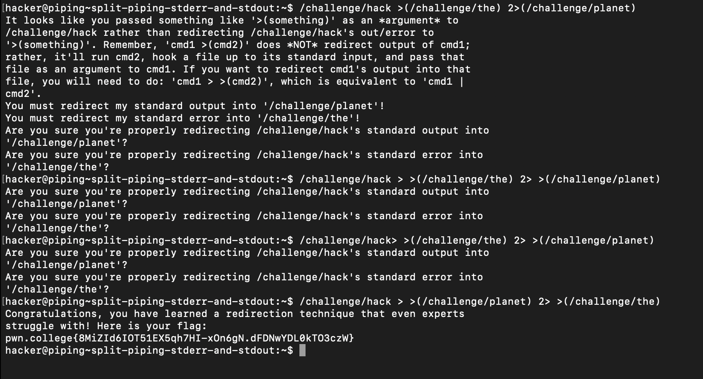

# **Practicing Piping**

## Redirecting Output

### Problem:


### Solution

For this challenge, we are supposed to redirect the output "PWN" to the file "COLLEGE", so using the echo command the string PWN is given as output which is fed to the file, the command used ```echo PWN > COLLEGE```

#### flag: ```pwn.college{cUiUIcwEltN522gDgS216qjW2Zh.dRjN1QDL0kTO3czW}```

## Redirecting More Output

### Problem:



### Solution:
For this challenge, we have to redirect the output of ```/challenge/run``` to myflag file, so i did that using the command ```/challenge/run > myflag```, this gives us the flag in the myflag file so i used the cat program to read the file using ```cat myflag```

**Note:** We dont directly use ```/challenge/run``` to print the output to terminal because the challege demands so, otherwise the test designed to check whether the output is redirected or not will fail.

#### flag: pwn.college{09gCL771fqsCs45yKNhYL_byS5s.dVjN1QDL0kTO3czW}

## Appending Output

### Problem:


### Solution:

For this challenge, we just had to append the output of ```/challenge/run``` to ~/the-flag, so using the command ```/challenge/run >> ~/the-flag``` appends the first part of the flag to the-flag file, running the same command ```/challenge/run >> ~/the-flag``` appends the second part of the flag. on reading the flag using cat command we get the flag for this challenge. ```cat the-flag```



#### flag: ```pwn.college{gmiwDfAkqLUK8jaN-PBV5TuMSoq.ddDM5QDL0kTO3czW}```

## Redirecting Errors

### Problem:


### Solution:
In this challenge, we are just supposed to redirect the output of ```/challenge/run``` to myflag and the error to instructions..this can be done using the command ```/challenge/run > myflag 2> instruction```, then the flag can be read in the myflag file using cat program , ```cat myflag```, doing ```cat instructions``` gives the description of whether the test was passed or not.


#### flag: ```pwn.college{MVlxzTjFcGWv9ioA-SfVr_7i00S.ddjN1QDL0kTO3czW}```

## Redirecting Inputs

### Problem:


### Solution:
For this challenge, we are supposed to redirect the output of ```echo COLLEGE``` to the file PWN, so we do that using ```echo COLLEGE > PWN```, after this we are supposed to redirect this as input to ```/challenge/run```, using ```/challenge/run < PWN``` this gives us the flag.

#### flag: ```pwn.college{AEBmFVO4PAmlO-jvcAZ3F0Aqe3D.dBzN1QDL0kTO3czW}```

## Grepping Stored Result

### Problem:



### Solution:

For this challenge, i first redirected the output of ```/challenge/run``` to data.txt which is in tmp directory, using the command ```/challenge/run > /tmp/data.txt```. after this i first grepped the string "flag" to search for the flag, but couldnt find it (using ```grep flag /tmp/data.txt```), so i searched pwn, and got the flag ( using ```grep pwn /tmp/data.txt```).

#### flag: ```pwn.college{M-5CUz3AcifXbrlhNJUR3-2g5TP.dhTM4QDL0kTO3czW}```

## Grepping Live Outputs

### Problem:


### Solution:
Instead of storing the output to the file, we directly give the output as an input to the grep program



we give the output of ```/challenge/run``` directly to the grep prgram using the command ```/challenge/run | grep pwn```, and search for the string "pwn"

#### flag: ```pwn.college{Me1zuFBbTgN5swi5WoqiVAVKEvl.dlTM4QDL0kTO3czW}```

## Grepping Errors

### Problem:


### Solution:
For this challenge, we just redirect the stderr (fd2) to stdout (fd1) using ">&" operator then that output is grepped with the string pwd, this gives the flag along with the checks 

```/challenge/run 2>&1 | grep pwd```

#### flag: ```pwn.college{U4q2kvelg6vMeESlYCSV-a-VYHY.dVDM5QDL0kTO3czW}```

## Duplicating Piped Data with tee

### Problem:


### Solution:

For this challenge, we had to intercept the output of ```/challenge/pwn``` using tee and then find the secret value that has to be given as an argument to ```/challenge/pwn``` before redirecting it to ```/challenge/college```

SO
the command was given by 
```/challenge/pwn | tee debug | /challenge/run```

after this the secret code was read using cat program 

```cat debug```

then finally the flag was retrieved using 

```/challenge/pwn --secret Uy9AAPMk | /challenge/college```

#### flag: ```pwn.college{Uy9AAPMkc9BirzfXmJdSENDZjpz.dFjM5QDL0kTO3czW}```

## Writing To Multiply Programs

### Program:





### Solution:


For the challenge, we had to redirect the output of ```/challenge/hack``` to ```/challenge/the``` and ```/challenge/planet``` simultaneously, so using the command ```/challenge/hack | tee >(/challenge/the) >(/challenge/planet)```, i got the flag. Initially i made mistake, missed a blanck space.

#### flag: ```pwn.college{UOA-CYyMc9he-HcWmGZdqU_AflC.dBDO0UDL0kTO3czW}```

## Split-piping stderr & stdout

### Problem:


### Solution:



In this challenge, the output of ```/challenge/hack``` should have been redirected to ```/challenge/planet``` and the error to ```/challenge/the```, (i mistaked it, thats why i failed twice, but then figured out the output should be directed to planet and error to the, not vice versa), then using ```/challenge/hack > >(/challenge/planet) 2> >(/challenge/the)```, i got the flag.

#### flag: ```pwn.college{8MiZId6IOT51EX5qh7HI-xOn6gN.dFDNwYDL0kTO3czW}```