# **Processes & Jobs**

## Listing Processes

### Problem:

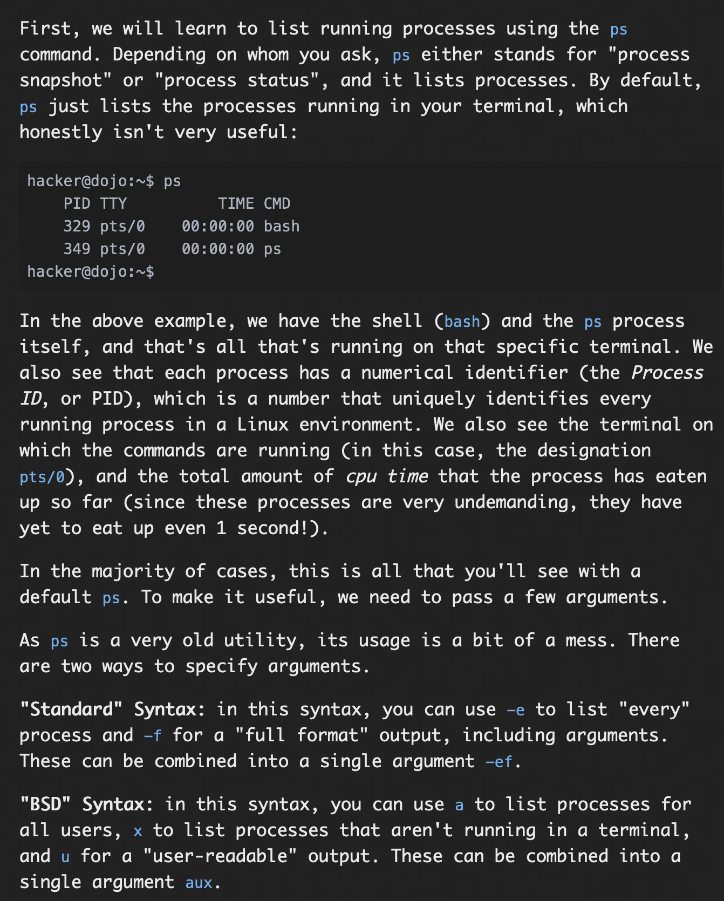
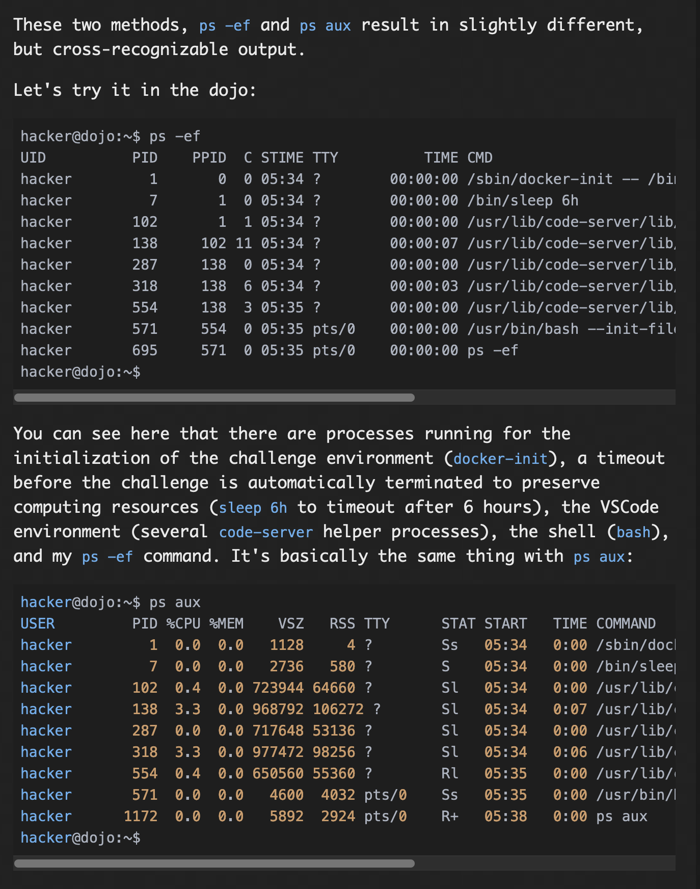
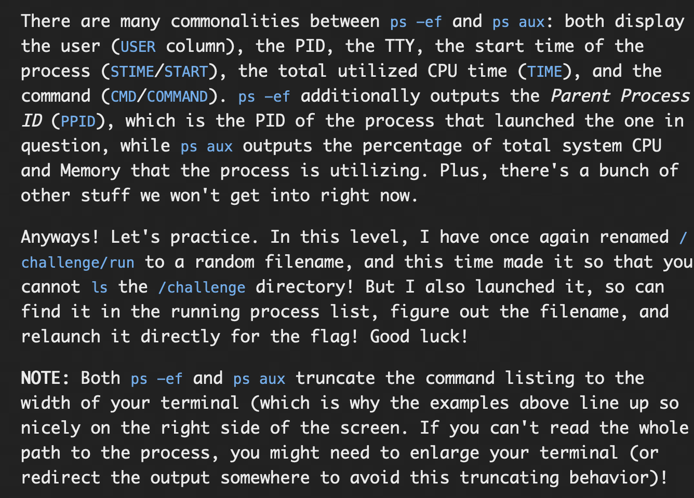

### Solution:

For this program, we are supposed to list down the processes (using ```ps aux```), then we can see the name of renamed run file, using the command ```/challenge/21464-run-5148```, this gives the flag, which can be used further on.

#### flag: ```pwn.college{4PQmzQuzmdLNOqdoluAiYWZDnob.dhzM4QDL0kTO3czW}```

## Killing Processes

### Problem:


### Solution:

For this challenge, first the process dont_run is killed, after locating its PID using the command ```ps -ef | dont_run```, the PID is 73 so  by using the command ```kill 73```, the process dont_run is killed. after this by using the command ```/challenge/run```, we get the flag.

#### flag: ```pwn.college{UJW-ApLtrn0UPHsv-qfsXwyeirw.dJDN4QDL0kTO3czW}```

## Interrupting Processes

### Problem:
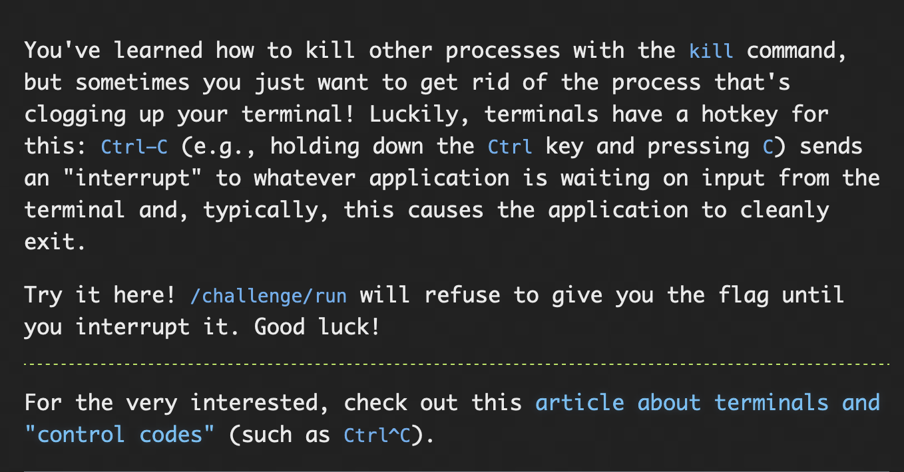

### Solution:

For this challege, first we had to execute ```/challenge/run```, then using the shortcut "control+c" we were supposed to interrupt the process, this gives the flag.

#### flag: ```pwn.college{oitDgAsTDvFiI_LJ60ihUtsAptr.dNDN4QDL0kTO3czW}```

## Suspending Processes

### Problem:
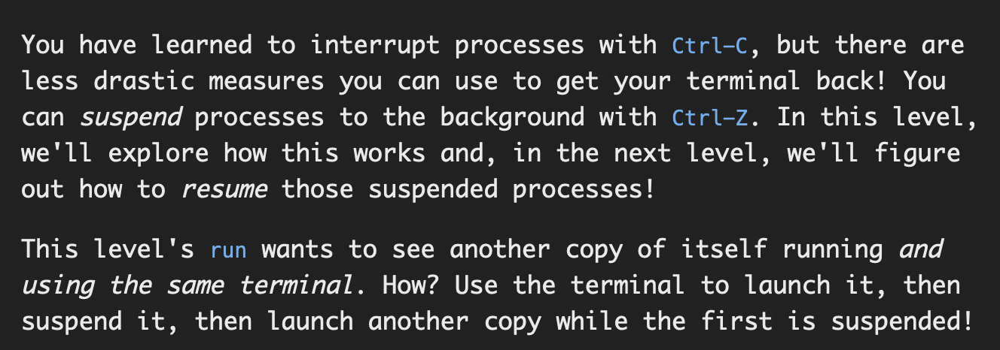

### Solution:
For this challenge, we need two run processes in the same terminal, so for this we first initiate one using the command ```/challenge/run```, after this, this process is suspended using the keyboard combination "control+z", then the run process is again launched using the command ```/challenge/run```

This gives the flag.

#### flag: ```pwn.college{0UUb2N4y3TF-T4GLCs78ULlnRNg.dVDN4QDL0kTO3czW}```

## Resuming Processes

### Problem:
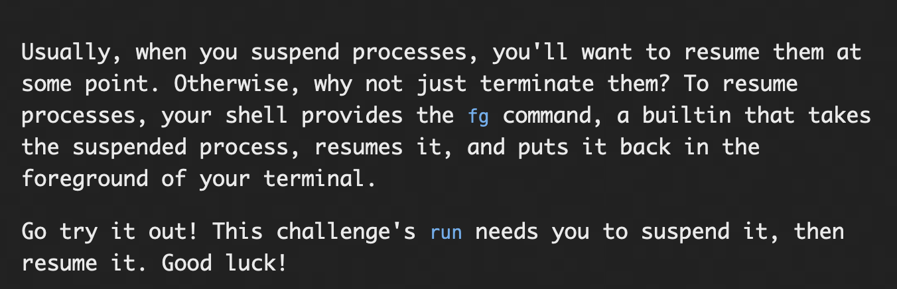

### Solution:
For this challenge, you first have to run the process run using the command ```/challenge/run```, then suspend it using the shortcut "control+z", after this resume the process using ```fg``` command

This gives the flag.

#### flag: ```pwn.college{YdLnlCJ7kYZsl8HSf4EyV2F7L_X.dZDN4QDL0kTO3czW}```

## Backgrounding Processes

### Problem:
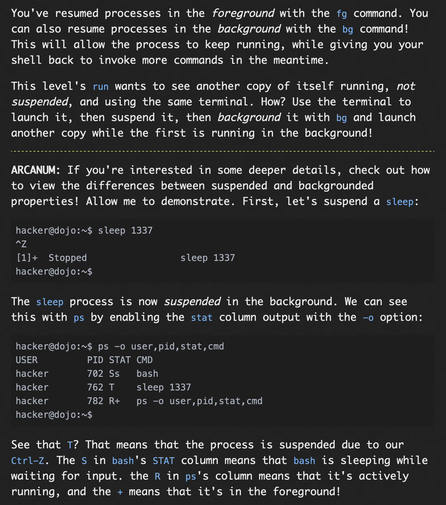
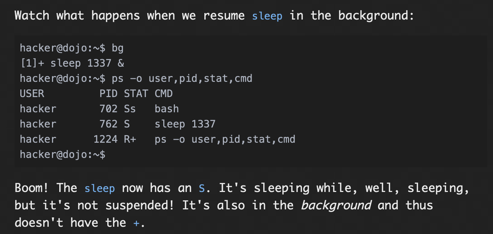

### Solution:
For this challenge, we again need two processes in the same terminal, but both of them should not be suspended so we acheive this bye first initiating one process using ```/challenge/run```, then suspend the process using the keyboard combination "control+z" then using command ```bg``` put the command to background then using ```/challenge/run``` initiate another process run in the same terminal. This gives the flag.

#### flag: ```pwn.college{MRhjfOhcbgqJe-IuNPAnUwGiHKK.ddDN4QDL0kTO3czW}```

## Foregrounding Processes

### Problem:
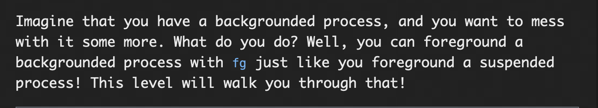

### Solution:

For this challenge, you have first initiate a run process using the command ```/challenge/run```, then after this, we are supposed to suspend this process using the keyboard combination "control+z", then we have put the suspended process to background using the command ```bg```, then using the ```fg``` command we have to put the process to foreground, after that, hitting the return key, we get the flag.

#### flag: ```pwn.college{EGoDFg7IumMER6-DkXToFnV56yz.dhDN4QDL0kTO3czW}```

## Starting Background Processes

### Problem:
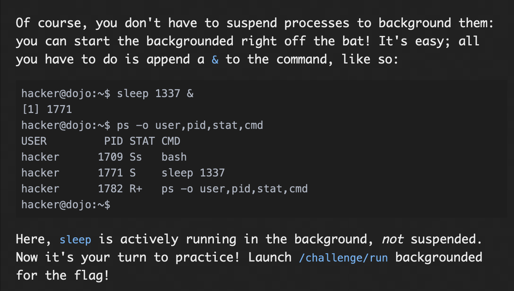

### Solution:
For this challenge, we are just supposed to initiate the run process in the background, this can be done using the command ```/challenge/run &```, this gives us the flag.

#### flag: ```pwn.college{MUHHBGVKpbmKFuLLoA5GcLgEyvH.dlDN4QDL0kTO3czW}```

## Process Exit Codes

### Problem:

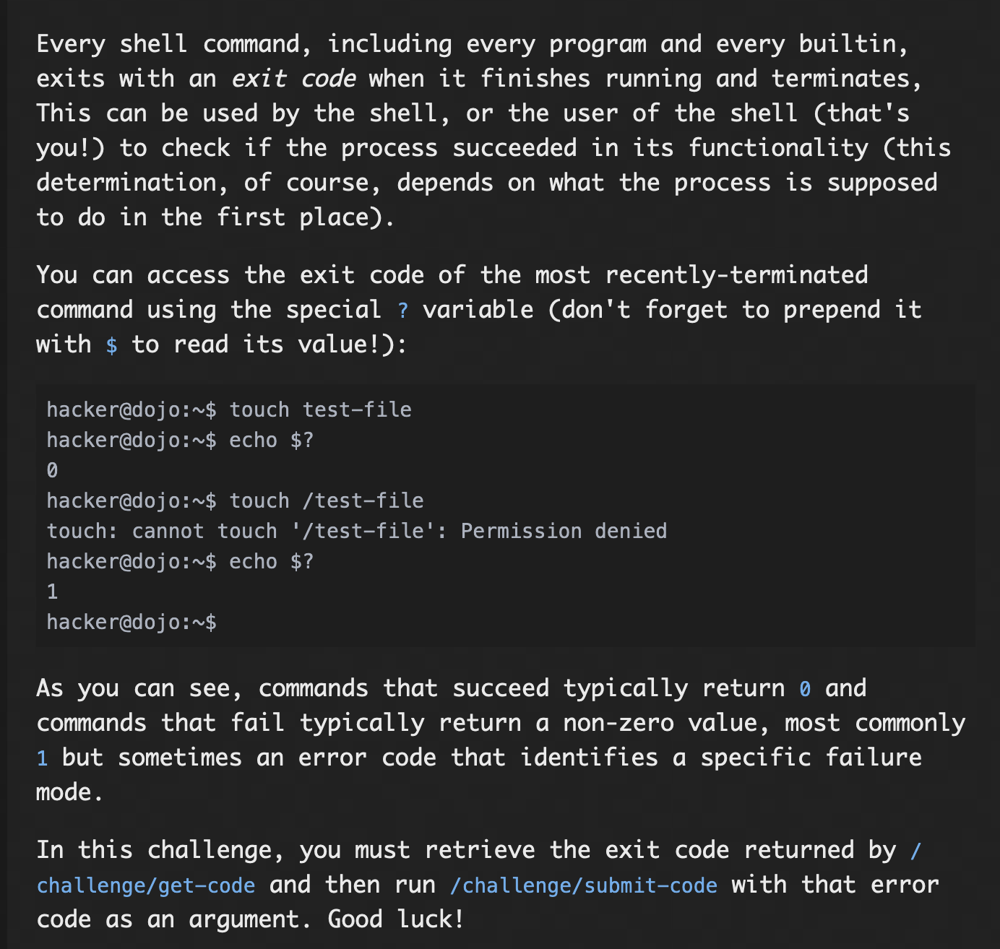

### Solution:
generally 0- no error, non 0, some error when the process terminated, can be checked using '?' variable, eg: ```echo $?```

For this challenge, we are supposed to get the exit code of the process get-code, so this can be done using ```/challenge/get-code``` to start the process, then ```echo $?``` to retrive the exit code, then this code has to be passed to another command ```/challenge/submit-code```, with the exit code as argument. So using the command ```/challenge/submit-code 7``` in my case. This gives the flag.

#### flag: ```pwn.college{ss3gWQMCzfyu_Ha82NvkiQv3QU5.dljN4UDL0kTO3czW}```

