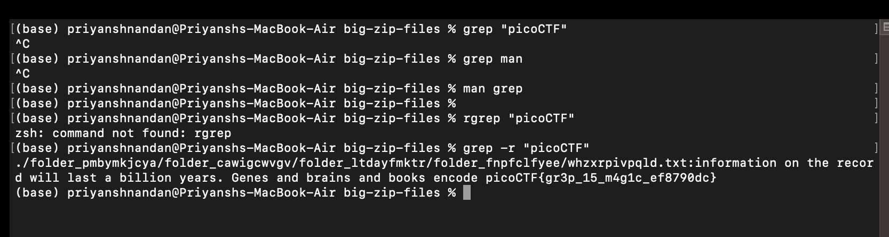

# Big Zip

## Challenge:


For this challege, we just have to look for the flag in the directory.

## Solution:
For this challenge, I initially tried using ```grep "picoCTF"``` in the "big-zip-files" directory, after which the process got stuck, so terminated that, then read the manual for grep, then after going through it, i though about recurrsively searching so that it goes in sub directories. used the command ```grep -r "picoCTF"```, this gave me the flag.



### flag: ```picoCTF{gr3p_15_m4g1c_ef8790dc}``