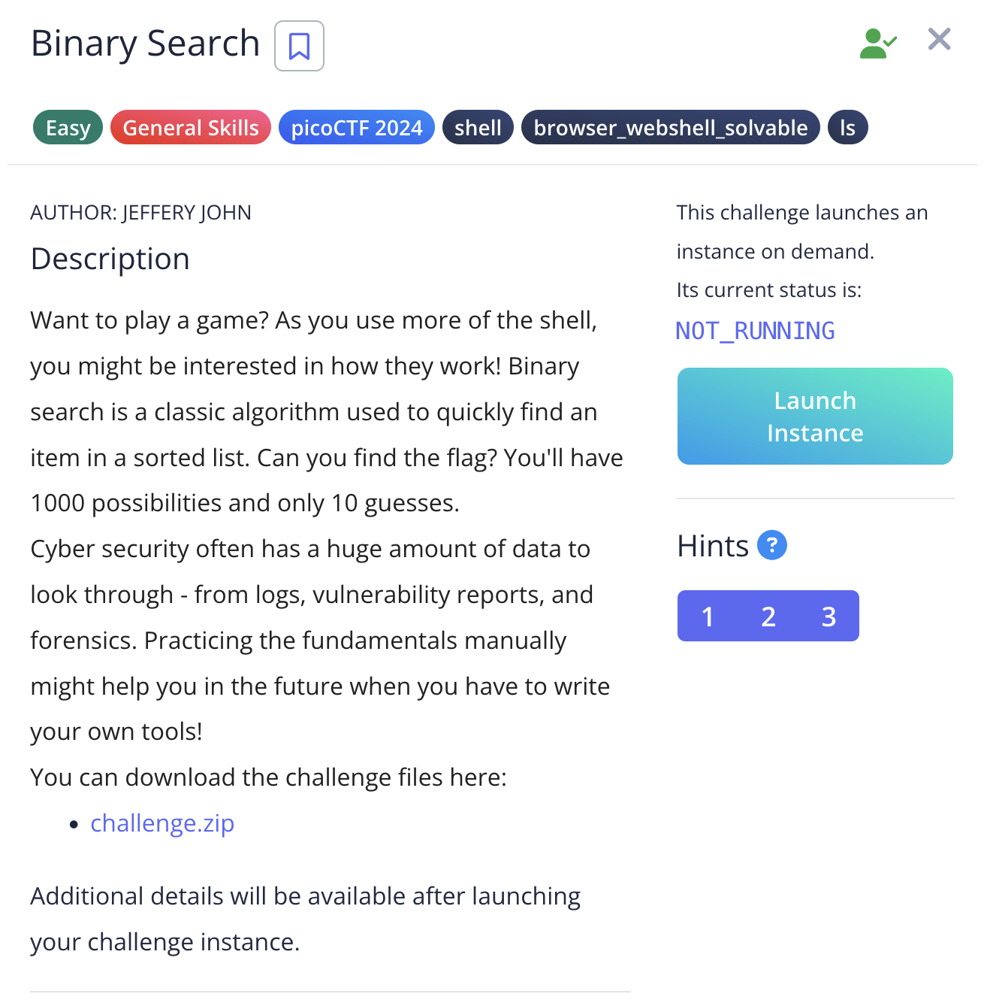
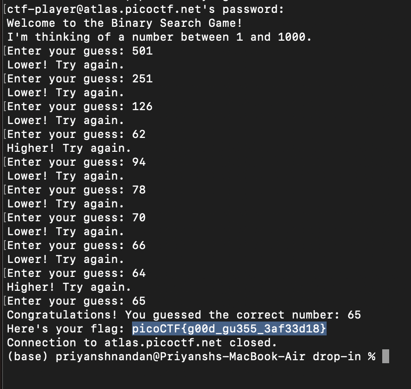

# Binary Search

## Challenge:



For this challenge we were just supposed to use binary search algorithm to guess number, when we enter that number in the shell we get the flag.

## Solution:


### flag: ```picoCTF{g00d_gu355_3af33d18}```