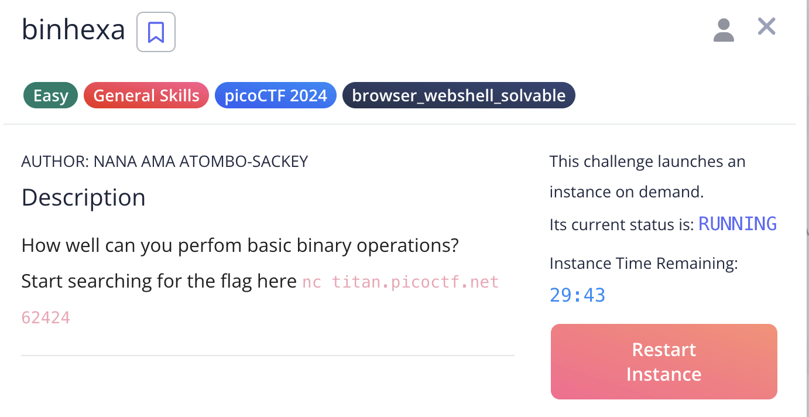
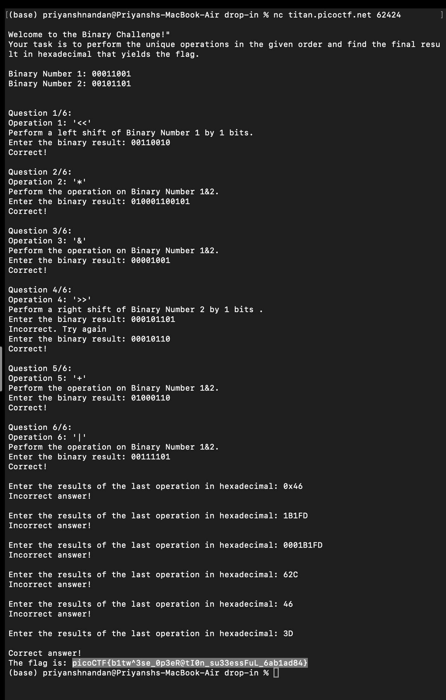

# Binhexa

## Challenge:



For this challenge, we have to perform various binary calculations and get the result, after that the program gives the flag.

## Solution:



### flag: ```picoCTF{b1tw^3se_0p3eR@tI0n_su33essFuL_6ab1ad84}```