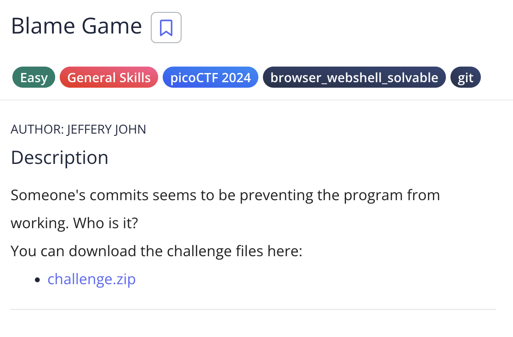
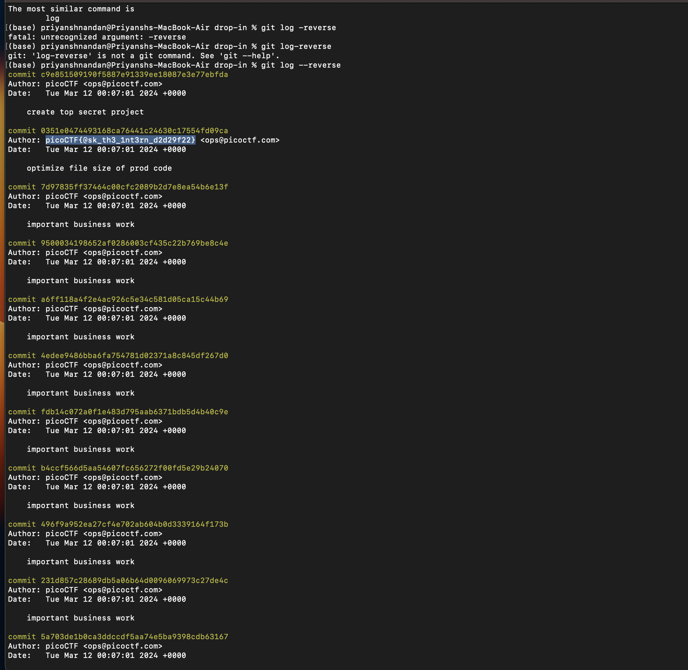

# Blame Game

## Challenge:


For this problem, we just have to see the log of the commit history, so that we can identify who broke the code.

## Solution:


So for this program what I initially did was just saw the log using ```git log```, after glancing it, i observed that it was very long, and every commit had a message "Important buisness work". So i opened the log in reverse this time using the command ```git log --reverse```, to check for the first commit, but then i saw the commit after that had the flag as its author so i got the flag.

### flag: ```picoCTF{@sk_th3_1nt3rn_d2d29f22}```