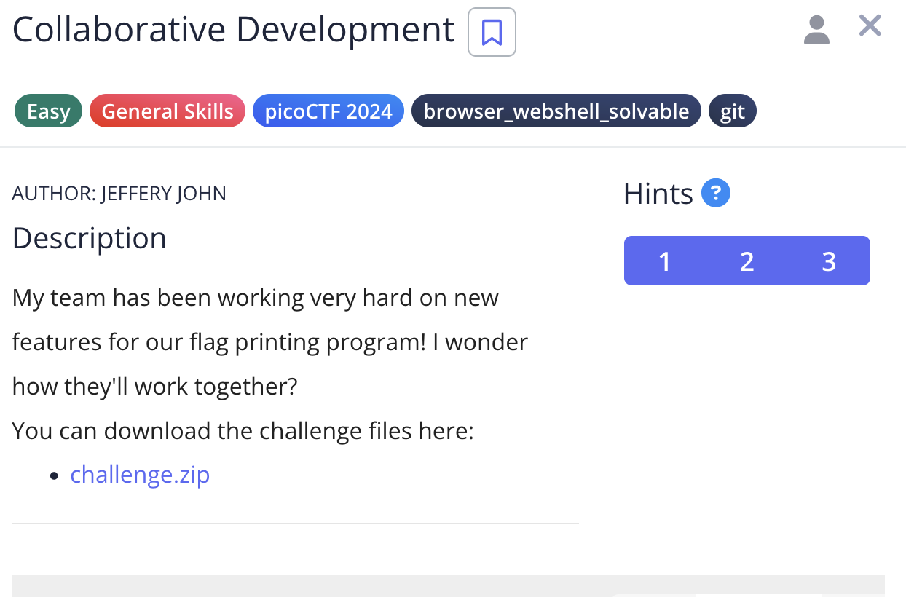
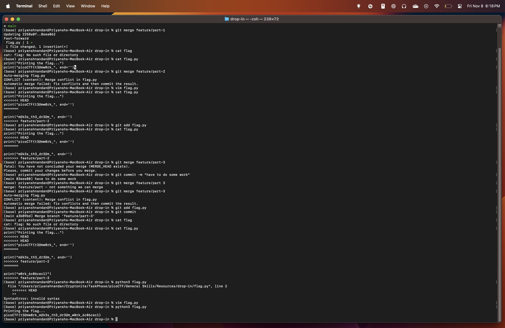
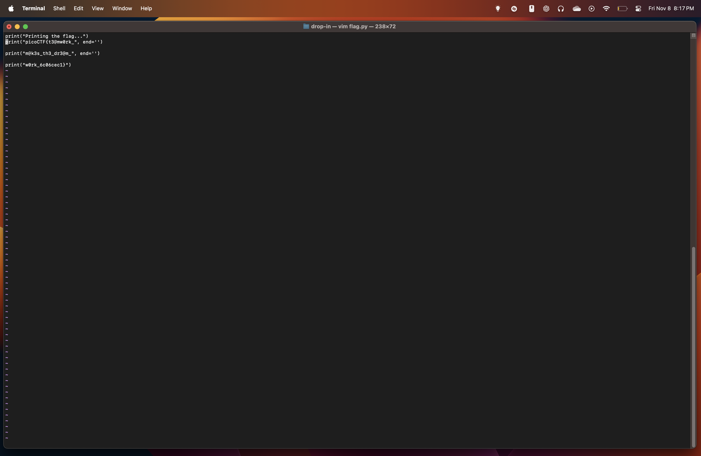

# Collaborative Development

## Challenge:



## Solution:
For this challenge, we just have to switch the branch and check cat file, then we can manually merge them, thats what i did.

Alternatively we can merge them in main, then on running the python script, we can get the flag.




### flag: ```picoCTF{t3@mw0rk_m@k3s_th3_dr3@m_w0rk_6c06cec1}```