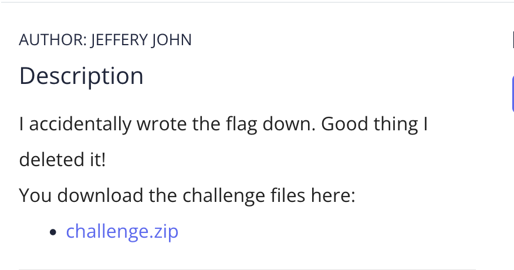
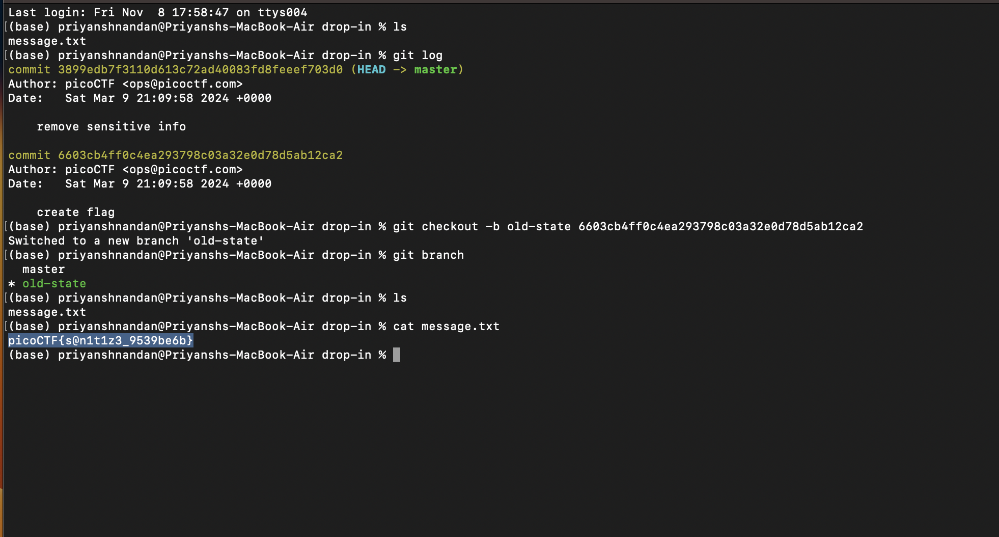

# Commitment Issues

## Challenge:


## Solution:
For this challenge, we check the log, and change the pointer to previous state, instead of that i created a new branch and there restored the previous commit, using the command ```git checkout -b old-state 6603cb4ff0c4ea293798c03a32e0d78d5ab12ca2```

After that on reading the file, i got the flag



### flag: ```picoCTF{s@n1t1z3_9539be6b}```