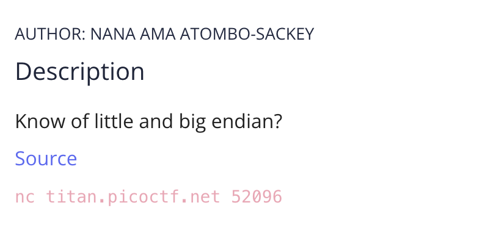
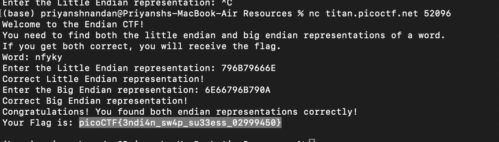

# Endianness

## Challenge:


### Endianness is the representation of how the address of data is read in the memory.
### Little Endian: Ascending, MSB last.
### Big Endian: Dscending, MSB first.

## Solution:

For this challenge, first i connected to the net cap portal using ```nc tital.picoctf.net 52096```, that executed the c program given in the source, and gave a string, then for little endian i reversed the given string and gave it to an ASCII to hexcode converter online, then remove spaces and gave the number we got to the program, then i prompted for Big endian, for this i just used the online tool to convert the string to hex-code, remove spaces gave to c program, this gave me the flag

;

### flag: ```picoCTF{3ndi4n_sw4p_su33ess_02999450}```