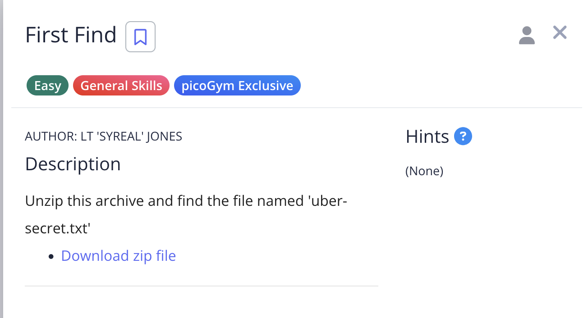
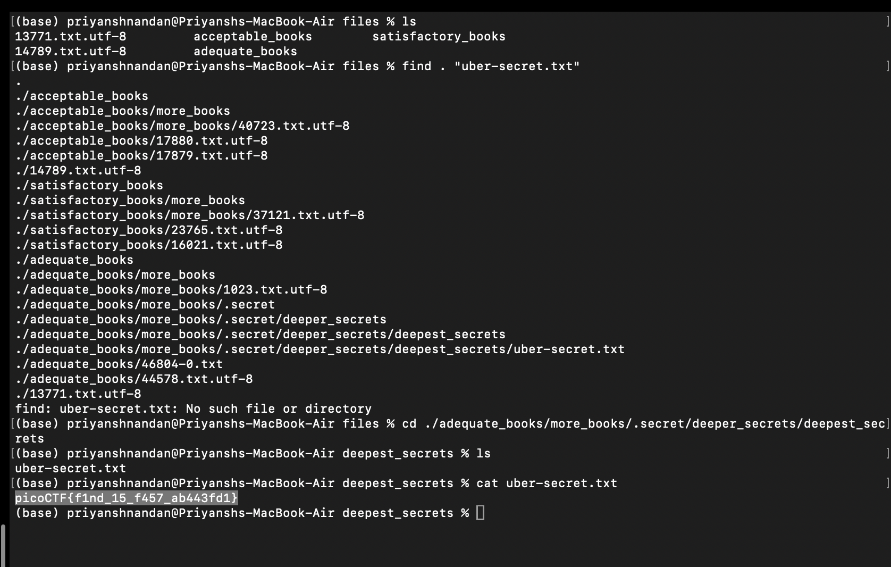

# First Find

## Problem:


For this challenge, we just have to locate the file uber-secret.txt and thre we get the flag

## Solution:

Using the command ```find . "uber-secret.txt"```, i get the path to the file, then i go to the directory using the command ```cd ./adequate_books/more_books/.secret/deeper_secrets/deepest_secrets/```, then using the program ```cat uber-seccret.txt```, i get the flag.



### flag: ```picoCTF{f1nd_15_f457_ab443fd1}```