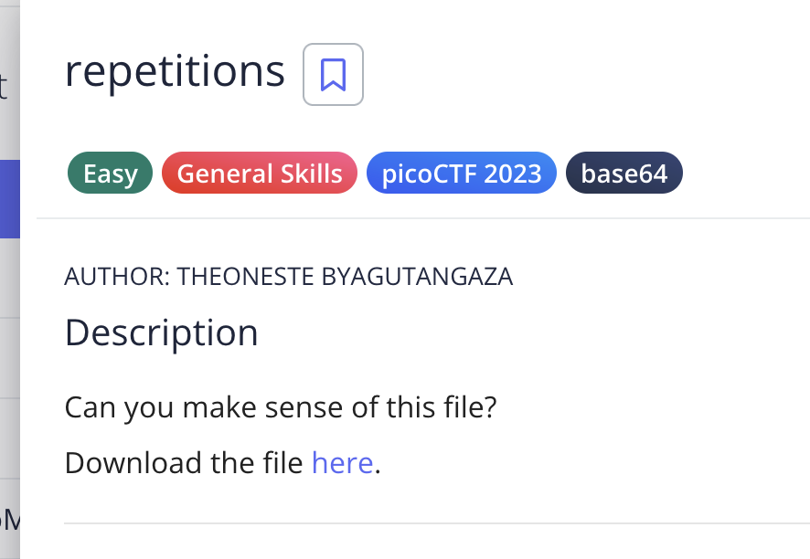

# Repetition

## Challenge:

For this challenge, we just of to decode the message encoded in base64

## Solution:
We have to decode the message multiple times, which i used an online base64 decoder tool to do.

I know a base64 Decoder is baked into the terminal, but i can not figure out what arguments must be provided, so that it decodes it properly

### flag: ```picoCTF{base64_n3st3d_dic0d!n8_d0wnl04d3d_492767d2}```