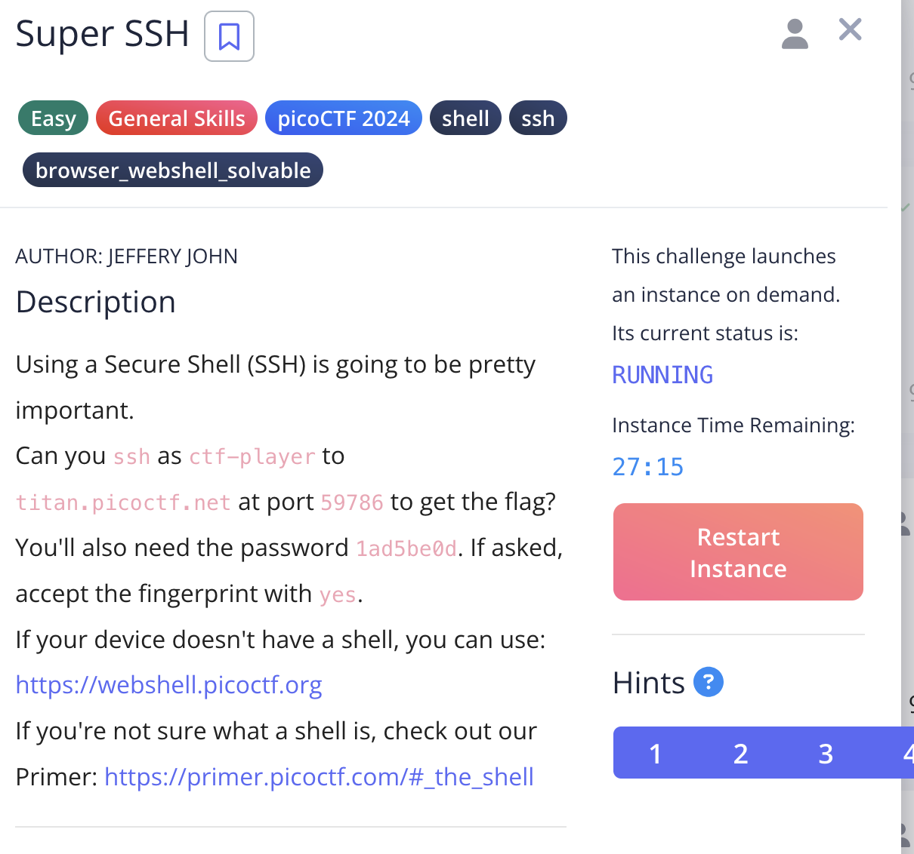
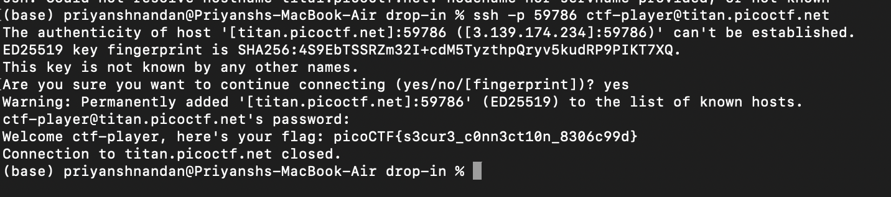

# Super SSH

## Challenge:

For this challenge, we just have to connect so a secure shell, then we are given the password, using that we do and we get the flag.



## Solution:

Command used : ```ssh -p 59786 ctf-player@titan.picoctf.net```




### flag: ```picoCTF{s3cur3_c0nn3ct10n_8306c99d}```
