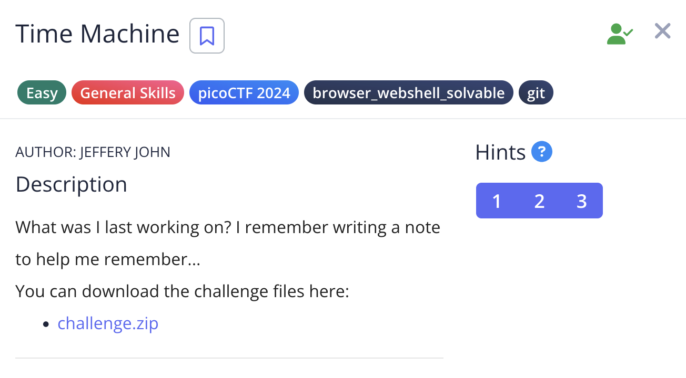

# Time Machine

## Challenge:


For this challenge, we just have to check the git log in the correct directory.


## Solution:

In drop-in directory, using the command ```git log```, gives me the git commit log, there i see the flag.


### flag:  ```picoCTF{t1m3m@ch1n3_e8c98b3a}```