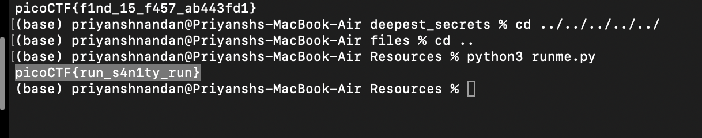

# runme.py

## challenge

We are just supposed to run the python script runme.py


## Solution:

Using the command ```python3 runme.py```, i just run the program. (since i have python3 installed in my pc)



### flag: ```picoCTF{run_s4n1ty_run}```