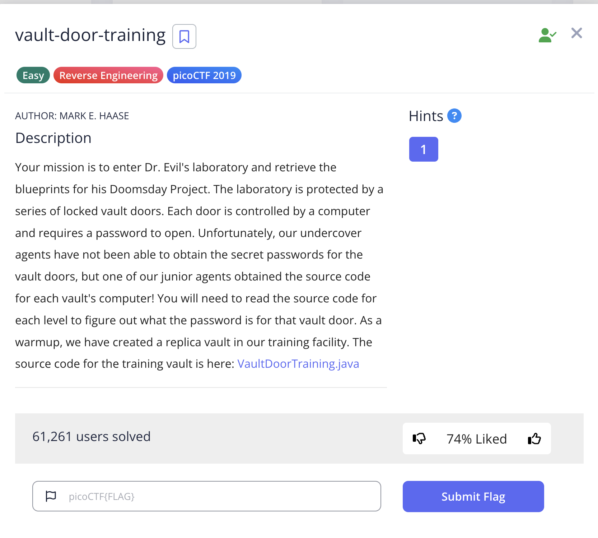
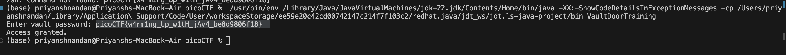

# Vault-Door *Training*

## Challenge:


## Solution:
For this challenge, we are given the source code to the software behind vault door, we just anaylise the code, and get the flag.



### flag: ```picoCTF{w4rm1ng_Up_w1tH_jAv4_be8d9806f18}```