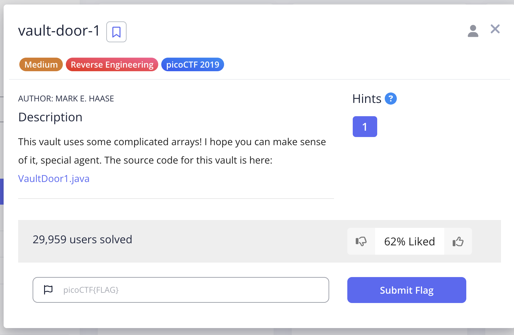
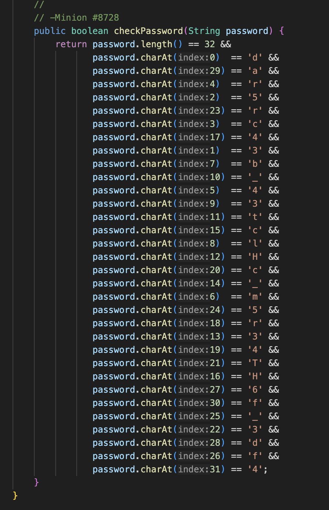
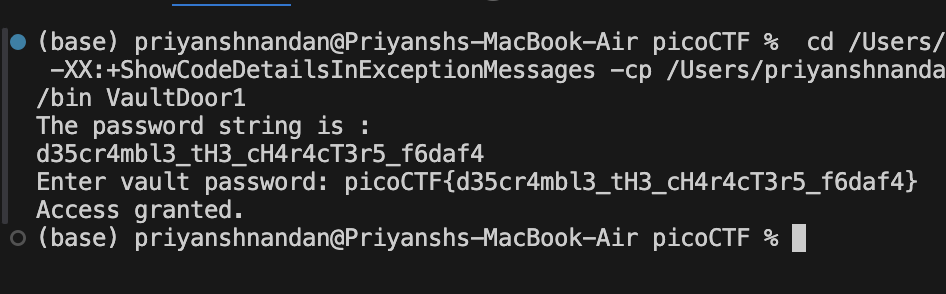

# Vault Door 1

## Challenge:



## Solution:

On opening the source code we observe that the password string is just broken in 32 letters, each letter marked to some index 0-31...we just have to sort them..

So for this challenge, I just wrote a function that sorts the array according to the index, and then prints the password string, then called this function in the main function. Then by appending picoCTF{ and }, i got the flag.



### Code Snippet
```
void printpasswordstring(){
        int[] indices = {0, 29, 4, 2, 23, 3, 17, 1, 7, 10, 5, 9, 11, 15, 8, 12, 20, 14, 6, 24, 18, 13, 19, 21, 16, 27, 30, 25, 22, 28, 26, 31};
        char[] pass = {'d', 'a', 'r', '5', 'r', 'c', '4', '3', 'b', '_', '4', '3', 't', 'c', 'l', 'H', 'c', '_', 'm', '5', 'r', '3', '4', 'T', 'H', '6', 'f', '_', '3', 'd', 'f', '4'};
        for(int i = 0; i < indices.length - 1; i++) {
            for(int j = 0; j < indices.length - i - 1; j++) {
                if(indices[j] > indices[j + 1]) {
                    int temp = indices[j];
                    indices[j] = indices[j + 1];
                    indices[j + 1] = temp;

                    
                    char tempo = pass[j];
                    pass[j] = pass[j + 1];
                    pass[j + 1] = tempo;
                }
            }
        }
        for(char ch : pass) {
            System.out.print(ch);
        }
        System.out.println();
    }
```


### flag: ```picoCTF{d35cr4mbl3_tH3_cH4r4cT3r5_f6daf4}```

