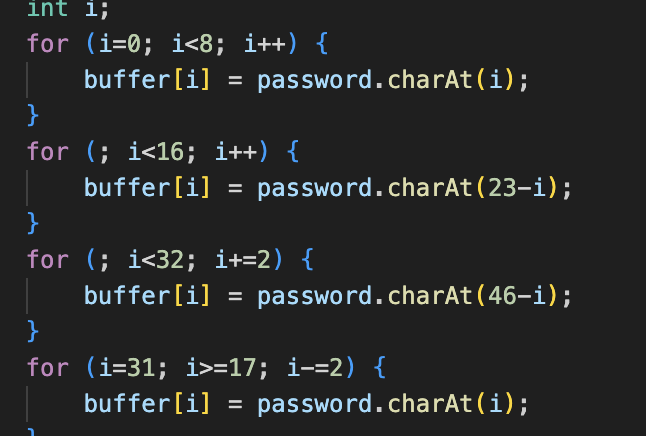
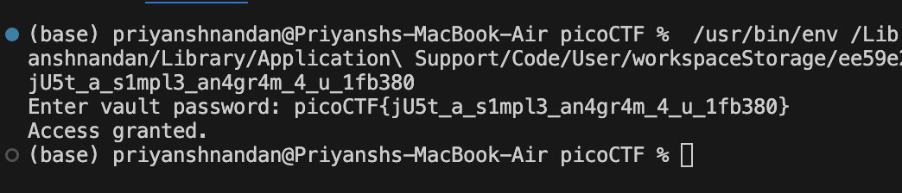

# Vault Door 3

## Challenge:

For this challenge, the password string is given as an anagram already, so following the rules given we can generate the string from which the anagram will be generates.

## Solution:
So I wrote a function that generates the anagram accoring to the rules followed 


So the function just follow the rules to generate the original string from the anagramed string 

### Code Snippet
```
void generatepass(){
        String password="jU5t_a_sna_3lpm18gb41_u_4_mfr340";
        char[] buffer = new char[32];
        int i;
        for (i=0; i<8; i++) {
            buffer[i] = password.charAt(i);
        }
        for (; i<16; i++) {
            buffer[i] = password.charAt(23-i);
        }
        for (; i<32; i+=2) {
            buffer[i] = password.charAt(46-i);
        }
        for (i=31; i>=17; i-=2) {
            buffer[i] = password.charAt(i);
        }
        String s = new String(buffer);
        System.out.println(s);
    }

```
This gives the flag string, which when appended with "picoCTF{" and "}", gives the flag.


### flag: ```picoCTF{jU5t_a_s1mpl3_an4gr4m_4_u_1fb380}```
