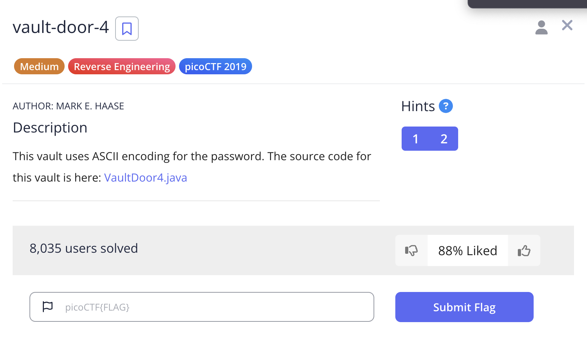
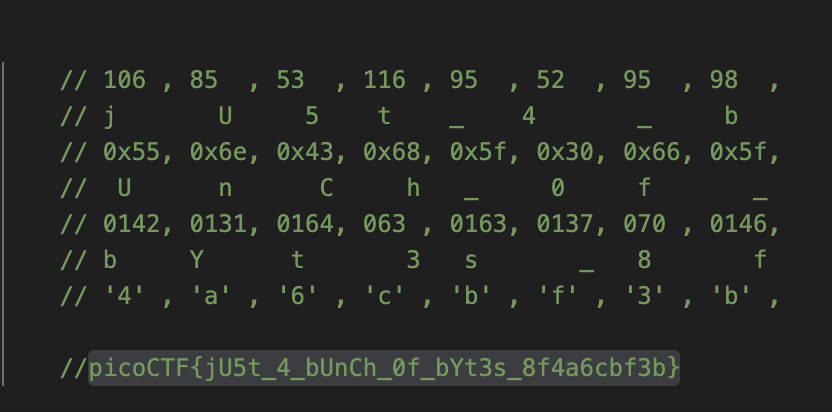
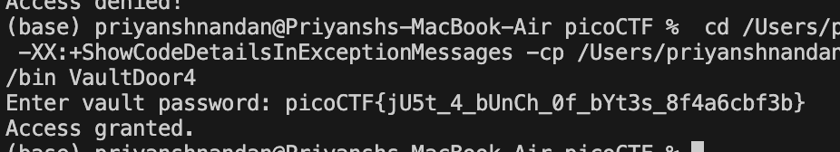

# Vault Door 4

## Challenge:


For this challenge, we are just supposed to retrieve the password form the source code which is encoded, the first row is just ASCII representation of Character, the second row is hexadecimal representation of character, 3rd one was octal representation of character and the last one was normal character representation as they are enclosed in single quotes ```' '```

## Solution:

Using the ASCII table, I just compared every character, and then i got the password character, when enclose with "picoCTF{" and "}", gives the flag





### flag: ```picoCTF{jU5t_4_bUnCh_0f_bYt3s_8f4a6cbf3b}```