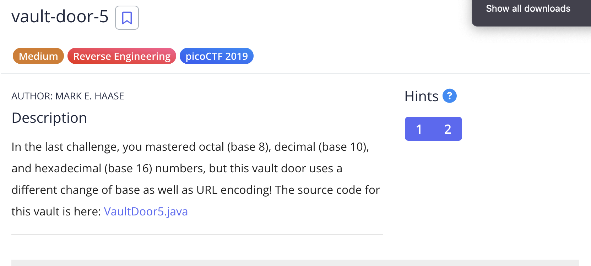
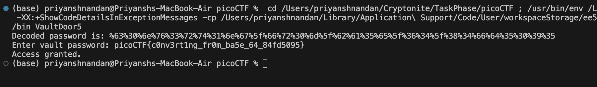

# Vault Door 5

## Challenge:

For, this challenge, the password string will be encoded in base64 first and then using url encoder, it encoded further.

## Solution:

So, my approach was, i first converted the required output string from the encoded urlstring to base64 string, then i passed the output to base64 decoder, which gave me string of hexadecimal number, then i compared each letter with ASCII table, which gave me the required password string. On appending that string with "picoCTF{" and "}" i got the flag

### Code Snippet:
```

    public void URLDecode(){
        String urlDecoded = URLDecoder.decode(
                "JTYzJTMwJTZlJTc2JTMzJTcyJTc0JTMxJTZlJTY3JTVmJTY2JTcyJTMwJTZkJTVmJTYyJTYxJTM1JTY1JTVmJTM2JTM0JTVmJTM4JTM0JTY2JTY0JTM1JTMwJTM5JTM1",
                StandardCharsets.UTF_8);

                byte[] base64Decoded = Base64.getDecoder().decode(urlDecoded);
                System.out.println("Decoded password is: " + new String(base64Decoded, StandardCharsets.UTF_8));
    }

```




### flag: ```picoCTF{c0nv3rt1ng_fr0m_ba5e_64_84fd5095}```