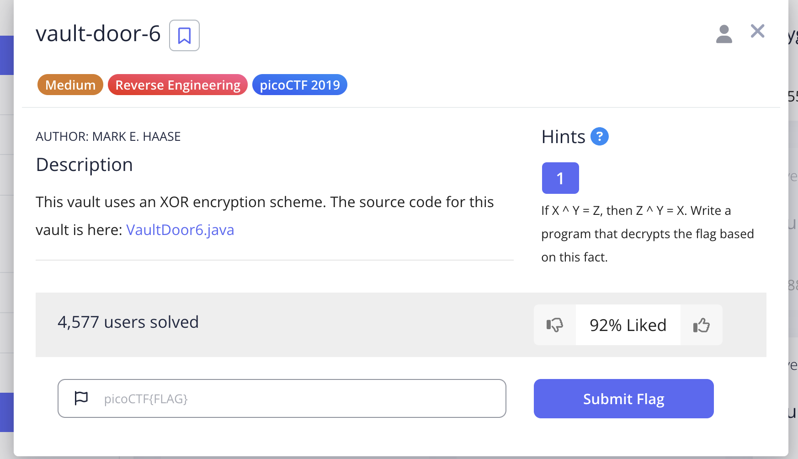
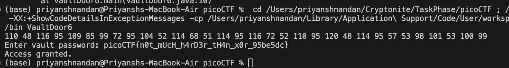

# Vault Door 6

## Challenge:




## Solution:
For this challenge, we just do xor of already xored element, which gives the decimal representation of character, which on using an online tool, we get the result.



### Code Snippet:
```
public void generatepass(){
        byte[] myBytes = {
            0x3b, 0x65, 0x21, 0xa , 0x38, 0x0 , 0x36, 0x1d,
            0xa , 0x3d, 0x61, 0x27, 0x11, 0x66, 0x27, 0xa ,
            0x21, 0x1d, 0x61, 0x3b, 0xa , 0x2d, 0x65, 0x27,
            0xa , 0x6c, 0x60, 0x37, 0x30, 0x60, 0x31, 0x36,
        };

        for(int i=0;i<32;i++){
            myBytes[i]=(byte) (myBytes[i] ^ 0x55);
            System.out.print(myBytes[i]+ " ");

        }
        System.out.println();
    }
```

### flag: ```picoCTF{n0t_mUcH_h4rD3r_tH4n_x0r_95be5dc}```
