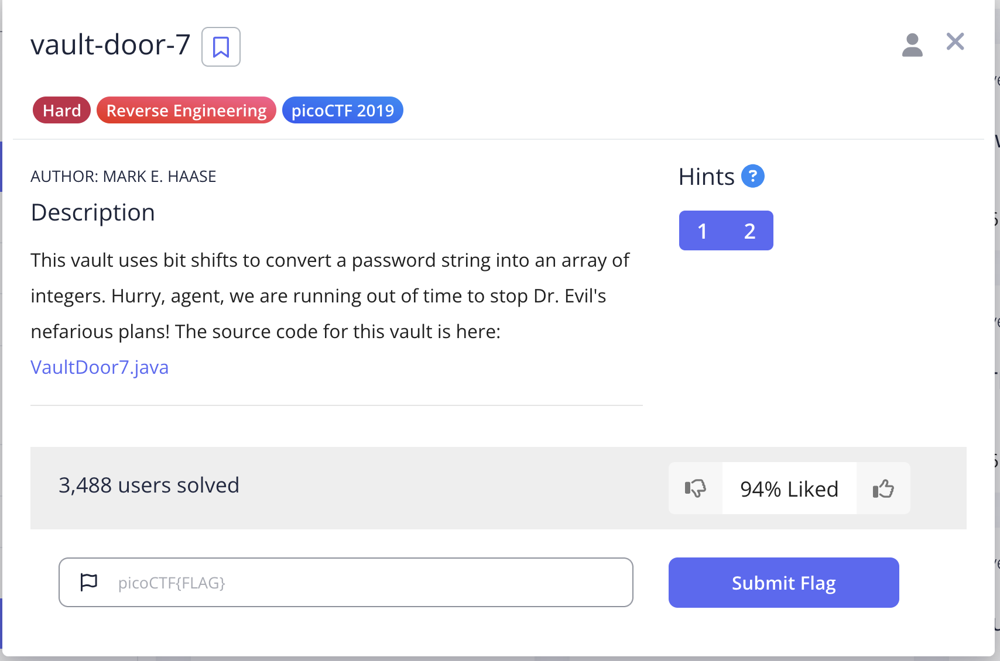
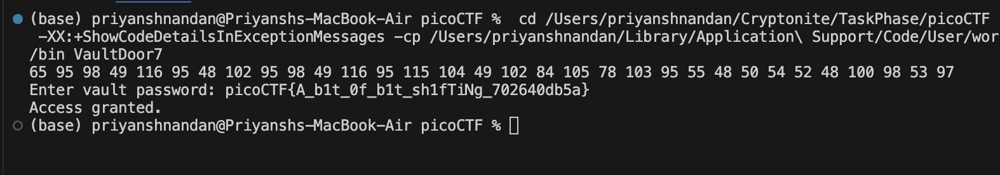
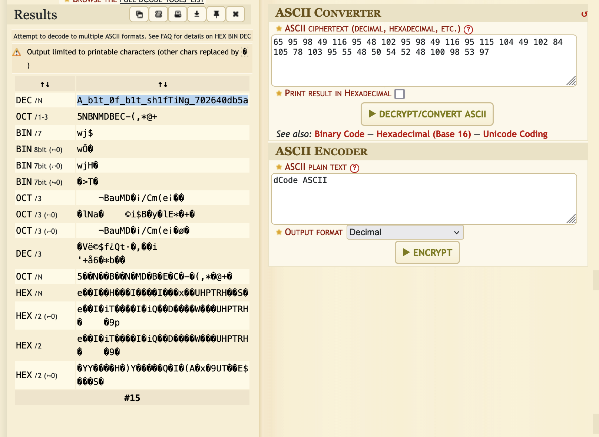

# Vault Door 7

## Challenge


## Solution:
For this challenge, we just do reverse engineer the solution, the bits that have been shifted left are shifted right same number of times when compared to the final output.

This gives us the Decimal ASCII representation
which we can convert into character set using the ASCII table 

I used an online tool to decrypt the ASCII decimal representation
This password string is then appended with "picoCTF{" and "}" to give the flag

### Code snippet:
```
void decrypt(){
        int[] x = {1096770097, 1952395366, 1600270708, 1601398833, 1716808014, 1734293296, 842413104, 1684157793};

        byte[] fromhex = new byte[32];

        for (int i = 0; i < 8; i++) {
            fromhex[i * 4] = (byte) (x[i] >> 24);
            fromhex[i * 4 + 1] = (byte) (x[i] >> 16);
            fromhex[i * 4 + 2] = (byte) (x[i] >> 8);
            fromhex[i * 4 + 3] = (byte) x[i];
        }
        
        for(int i=0;i<32;i++){
        System.out.print(fromhex[i]+" ");
        }
        System.out.println();
    }
```




### flag: ```picoCTF{A_b1t_0f_b1t_sh1fTiNg_702640db5a}```